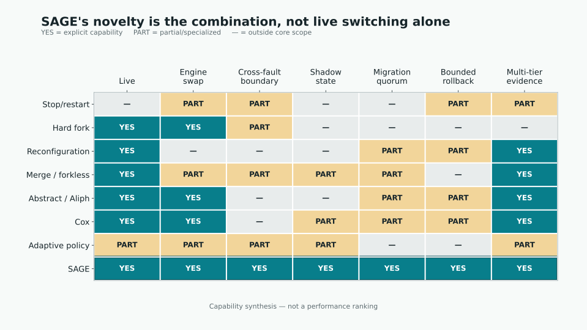
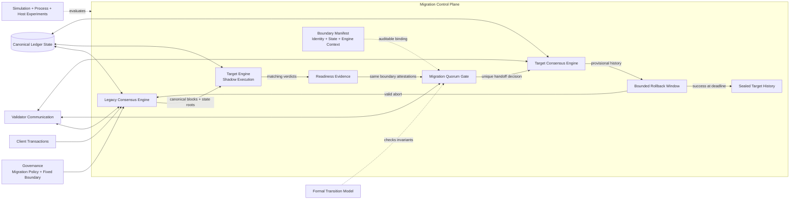
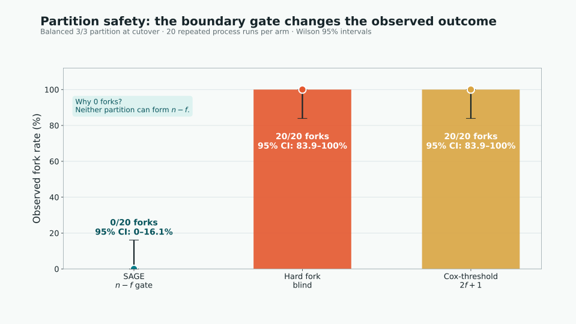
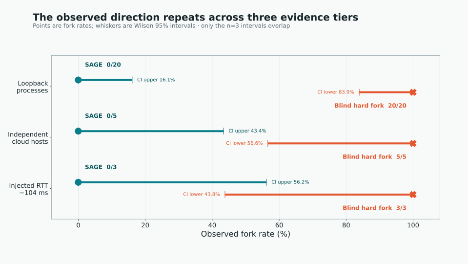
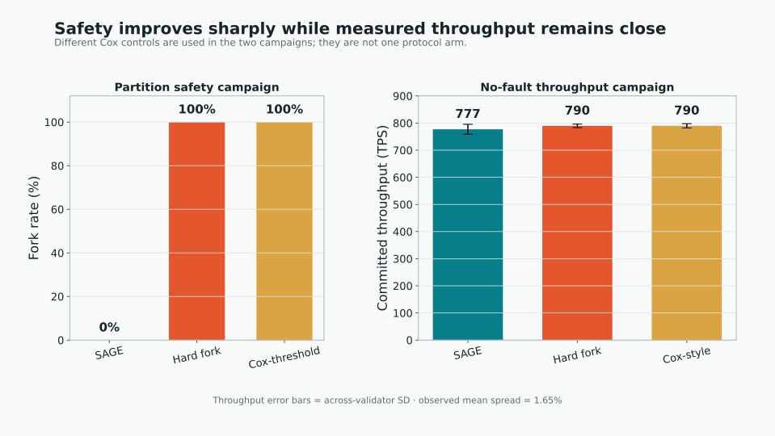
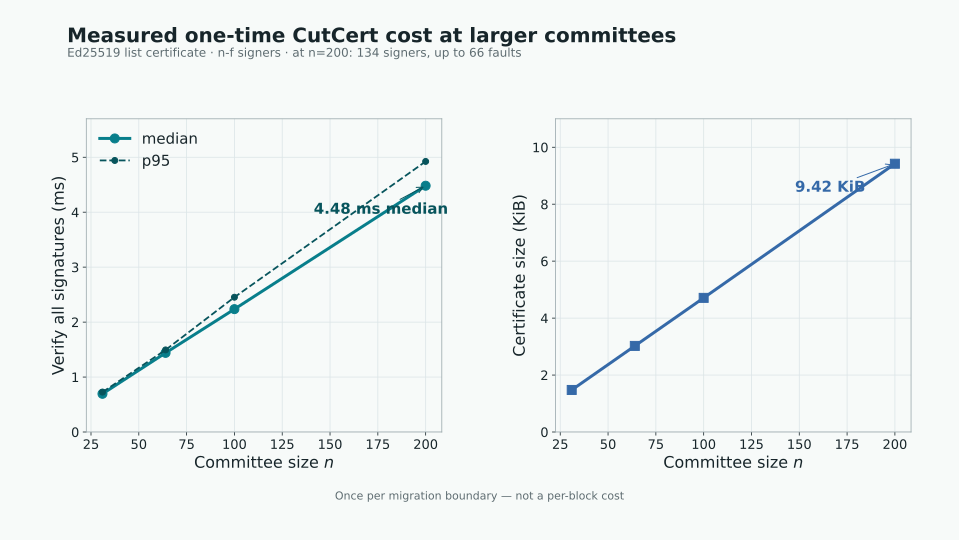
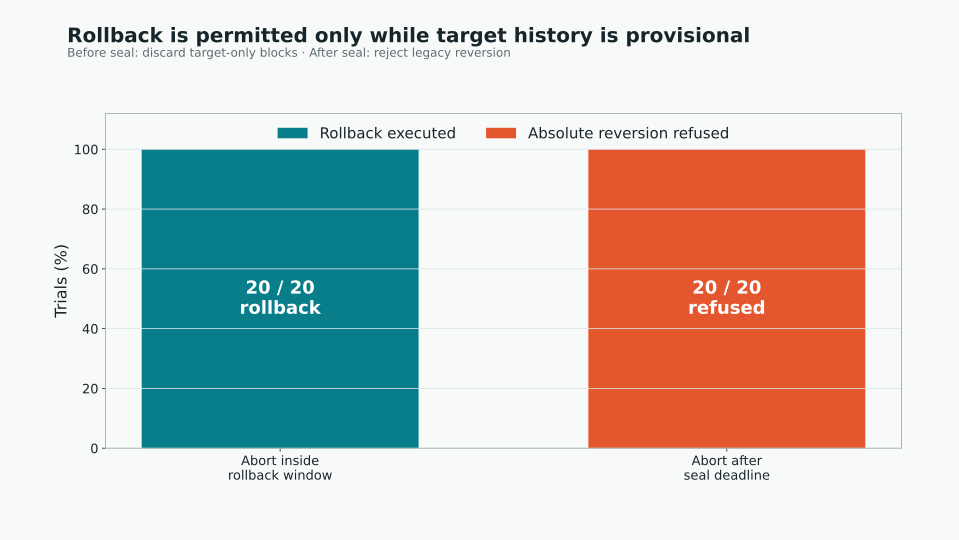

# Nội dung Seminar: SAGE — Shadow-Anchored Graceful Evolution

> **Thông điệp trung tâm:** SAGE là protocol và research artifact giúp một permissioned blockchain chuyển từ consensus engine cũ sang engine mới mà không cần một khoảng dừng vận hành được lên lịch, đồng thời dùng shadow validation, quorum-gated cutover và bounded rollback để bảo vệ ranh giới chuyển đổi.
>
> **Phạm vi trình bày trung thực:** SAGE hiện là research prototype được đánh giá bằng deterministic simulation, concurrent validator processes, bounded model checking và nhiều máy độc lập. Đây chưa phải một production blockchain platform hoàn chỉnh; durable recovery, production key management và geo-distributed validation vẫn là các hướng phát triển tiếp theo.
>
> **Cách sử dụng presenter scripts:**
> * **Bản đầy đủ 45–55 phút:** dùng toàn bộ script của Slides 1–13, Methodology và 6 figures.
> * **Seminar 25–30 phút:** mỗi slide đầu dùng `Hook/Mở đầu → Kết luận → Câu chuyển`; trình bày đầy đủ Slides 1, 2, 5, 8, 12, 13 và Figures 1, 3, 6.
> * **Pitch 15 phút:** dùng Slides 1, 2, 3, 5, 12, 13; Figure 1, Figure 3 và Figure 6; các slide còn lại làm backup.
> * Nội dung trong `<details>` là lời nói, không cần đưa lên màn hình; bảng, Mermaid và figure là phần hiển thị.

## 1. Introduction (Giới thiệu)

### Gợi ý Slide 1 — Blockchain là gì và có những mô hình nào?

> **Hook trên slide:** Một ledger có thể công khai cho mọi người quan sát, nhưng quyền tạo canonical history không nhất thiết mở cho mọi người.

| Câu hỏi thiết kế | Public / permissionless blockchain | Permissioned blockchain / DLT |
|---|---|---|
| Ai có thể đọc? | Thường bất kỳ ai | Công khai, giới hạn theo consortium, hoặc private channel |
| Ai có thể gửi transaction? | Thường bất kỳ ai có thể trả phí | Identity/account được cấp quyền theo policy |
| Ai có thể xác thực/finalise? | Open participation hoặc economic eligibility | Validator/operator đã được xác định |
| Sybil resistance | Proof of Work, Proof of Stake, economic cost | Identity, PKI, legal agreement, membership service |
| Governance | Social/on-chain governance, client adoption | Consortium, doanh nghiệp hoặc cơ quan quản trị |
| Ví dụ | Bitcoin, Ethereum, Solana | Hyperledger Fabric, permissioned Ethereum/Besu; Corda là permissioned DLT |

* **Public blockchain:**
  * Tối ưu cho môi trường nhiều bên không cần biết hoặc tin nhau trước.
  * Ledger và transaction validation thường có khả năng kiểm chứng công khai.
  * Sybil resistance dựa trên tài nguyên kinh tế như computation hoặc stake.
  * Đổi lại: throughput, privacy, fee predictability và governance coordination có thể khó hơn.
* **Permissioned blockchain:**
  * Validator và participant được nhận diện, cấp quyền và chịu policy cụ thể.
  * Có thể đạt deterministic finality nhanh, kiểm soát privacy và đáp ứng compliance tốt hơn.
  * Trust không biến mất; nó chuyển từ anonymous economic competition sang identity, quorum và governance.
* **Không phải hai hộp tuyệt đối:**
  * Một chain có thể public-read nhưng permissioned-write.
  * Một hệ thống có thể mở cho client nhưng giới hạn validator.
  * Điều quan trọng là tách read, submit, validate và govern permissions.

> **Thông điệp phải nhớ — Slide 1:** Public blockchain tối thiểu hóa nhu cầu tin vào danh tính; permissioned blockchain dùng danh tính và governance để tối ưu finality, privacy và vận hành.

<details>
<summary><strong>Kịch bản thuyết trình Slide 1 — Public và Permissioned Blockchain (3 phút)</strong></summary>

**Hook**

> “Trước khi nói về SAGE, chúng ta cần trả lời một câu cơ bản: blockchain mà chúng ta đang cố nâng cấp thuộc loại nào? Không phải mọi blockchain đều giải cùng một bài toán trust.”

**Định nghĩa blockchain bằng shared core**

> “Ở mức trừu tượng, blockchain là một replicated ledger: nhiều node thống nhất transaction order, thực thi state transition và duy trì một canonical history. Public và permissioned blockchain dùng cùng ý tưởng này, nhưng phân phối quyền tham gia rất khác.”

**Giải thích bốn quyền**

> “Tôi không muốn chỉ nói ‘public là mở, private là đóng’. Ta cần tách bốn quyền. Ai được đọc? Ai được gửi transaction? Ai được validate và finalise? Và ai có quyền đổi protocol? Một system có thể mở ở quyền thứ nhất nhưng đóng ở quyền thứ ba.”

**Public blockchain và ví dụ**

> “Bitcoin cho phép bất kỳ ai kiểm tra ledger và cạnh tranh bằng Proof of Work. Ethereum cho phép public verification và dùng Proof of Stake để chọn economic validators. Solana cũng public nhưng tối ưu execution và ordering theo thiết kế khác. Điểm chung là consensus không dựa vào một danh sách doanh nghiệp được cấp quyền trước.”

**Permissioned blockchain và ví dụ**

> “Hyperledger Fabric dùng membership identity, endorsement policy và ordering service cho consortium. Permissioned Ethereum, thường triển khai bằng Besu với PoA hoặc QBFT, giữ EVM compatibility nhưng giới hạn validator. Corda tập trung vào identified parties và selective data sharing cho workflows liên tổ chức.”

**Trade-off chứ không phải tốt/xấu**

> “Public blockchain tối ưu open participation và censorship resistance. Permissioned blockchain tối ưu deterministic finality, privacy, policy control và predictable operation. Trust không biến mất trong permissioned setting; nó được biểu diễn bằng identity, PKI, legal governance và quorum assumptions.”

**Câu chuyển slide**

> “Vậy tại sao doanh nghiệp và consortium chấp nhận permissioning? Slide tiếp theo nối mô hình này với các use case thực tế — và cũng chỉ ra technical debt mà họ nhận về.”

</details>

### Gợi ý Slide 2 — Vì sao tổ chức chọn Permissioned Blockchain?

| Use case | Các bên tham gia | Vì sao không chỉ dùng một database? | Ví dụ nền tảng/bối cảnh |
|---|---|---|---|
| Supply-chain provenance | Nhà sản xuất, logistics, hải quan, retailer | Nhiều tổ chức cùng ghi và audit provenance | Fabric-based consortium networks |
| Interbank settlement | Ngân hàng, clearing member, regulator | Shared finality giữa các pháp nhân độc lập | Corda, permissioned EVM networks |
| Trade finance | Buyer, seller, bank, insurer | Workflow và chứng từ cần common audit trail | Consortium DLT deployments |
| Enterprise asset/token network | Issuer, custodian, operator, auditor | Shared ownership state và programmable policy | Besu/QBFT-style deployments |
| Government/regulated records | Nhiều agency và service provider | Cross-agency integrity, provenance và access policy | Permissioned ledger pilots |

| Lợi ích nhận được | Đánh đổi đi kèm |
|---|---|
| Fast deterministic finality | Phụ thuộc validator identities và quorum configuration |
| Controlled privacy/access | Key, membership và policy lifecycle phức tạp |
| Predictable fee/performance | Ít open competition hơn, governance tập trung hơn |
| Regulatory accountability | Protocol upgrade cần phối hợp nhiều tổ chức |
| Custom consensus choice | Consensus assumptions có thể lỗi thời theo thời gian |

* **Khi database tập trung là đủ:**
  * Nếu một tổ chức duy nhất có authority và mọi bên đều chấp nhận authority đó, database thường đơn giản và hiệu quả hơn.
* **Khi permissioned ledger có lý do tồn tại:**
  * Nhiều tổ chức cần cùng ghi, cùng kiểm chứng nhưng không muốn một bên duy nhất kiểm soát toàn bộ history.
  * Governance và validator identity được biết trước, nhưng các bên vẫn cần chống unilateral rewrite hoặc inconsistent views.
* **Lifecycle pressure xuất hiện theo thời gian:**
  * Consortium mở rộng và validator set thay đổi.
  * Threat model chuyển từ crash/honest-authority sang Byzantine concerns.
  * Compliance, throughput và finality requirements tăng.
  * Consensus engine chọn ở ngày đầu có thể không còn phù hợp sau nhiều năm.

> **Thông điệp phải nhớ — Slide 2:** Permissioned blockchain mua efficiency và governance control bằng một cam kết dài hạn: consortium phải duy trì và tiến hóa consensus mà không phá shared history.

<details>
<summary><strong>Kịch bản thuyết trình Slide 2 — Từ use case đến lifecycle problem (3 phút)</strong></summary>

**Mở đầu**

> “Permissioned blockchain không nên được dùng chỉ vì từ blockchain hấp dẫn. Nếu một công ty duy nhất kiểm soát dữ liệu và mọi người tin công ty đó, database là lựa chọn tốt hơn. Permissioned ledger có ý nghĩa khi nhiều tổ chức cần một shared history nhưng không muốn giao toàn quyền cho một bên.”

**Dẫn các use case**

> “Trong supply chain, nhà sản xuất, logistics, hải quan và retailer cần cùng audit provenance. Trong interbank settlement, nhiều ngân hàng cần chung một final state mà mỗi bên có thể kiểm chứng. Trade finance kết nối chứng từ và obligations giữa buyer, seller, bank và insurer. Asset networks cần issuer, custodian và auditor cùng nhìn một ownership state.”

**Vì sao permissioned model hấp dẫn**

> “Vì validator đã biết danh tính, hệ thống có thể dùng deterministic finality nhanh hơn, kiểm soát data visibility, đặt policy rõ và dự đoán operational cost. Đây là lý do Fabric, Corda và permissioned EVM deployments xuất hiện trong enterprise/regulated settings.”

**Reveal cái giá phải trả**

> “Nhưng bảng dưới cho thấy lợi ích luôn đi kèm lifecycle burden. Identity-based trust đòi key và membership management. Fast finality phụ thuộc đúng quorum configuration. Custom consensus tạo flexibility ngày hôm nay nhưng cũng tạo protocol lifecycle ngày mai.”

**Tình huống dẫn vào SAGE**

> “Một consortium có thể bắt đầu với bốn hoặc sáu authority dùng PoA vì đơn giản. Sau vài năm, nó mở rộng, có nhiều operator độc lập hơn và muốn Byzantine tolerance. Ledger không thể reset vì chứa shared commitments. Service không muốn dừng. Nhưng consensus engine cũ không còn phù hợp.”

**Phát biểu vấn đề nghiên cứu**

> “Đây chính là điểm xuất phát của SAGE: permissioned blockchain cần tiến hóa trust model và consensus engine trong khi vẫn bảo toàn một canonical history.”

**Câu chuyển slide**

> “Slide tiếp theo zoom vào thời điểm nguy hiểm nhất của lifecycle đó: chuyển quyền finalise từ legacy engine sang target engine.”

</details>

### Gợi ý Slide 3 — Bối cảnh và bài toán

| Áp lực thay đổi | Trạng thái legacy | Nhu cầu mới | Rủi ro nếu chuyển sai |
|---|---|---|---|
| Trust model | PoA/honest authority | Byzantine tolerance | Legacy guarantee bị hiểu quá mức |
| Quy mô validator | Nhỏ, tương đối ổn định | Mở rộng hoặc thay committee | Quorum cũ không còn phù hợp |
| Hiệu năng | Engine cũ đạt giới hạn | BFT/DAG-BFT mới | Benchmark engine bị lẫn với migration cost |
| Vận hành | Upgrade bằng halt/flag day | Live transition | Split-brain hoặc downtime |

* **Giới thiệu vấn đề:**
  * Permissioned blockchain thường tồn tại nhiều năm, trong khi trust model, validator set, yêu cầu throughput và tiêu chuẩn bảo mật liên tục thay đổi.
  * Consensus engine ban đầu có thể không còn phù hợp:
    * PoA đơn giản nhưng phụ thuộc mạnh vào validator/operator đáng tin cậy.
    * BFT engine như HotStuff chịu Byzantine fault tốt hơn nhưng có protocol state, quorum rule và finality semantics khác.
  * Thay consensus engine không chỉ là triển khai một phiên bản phần mềm mới:
    * Hai engine có thể dùng quorum threshold khác nhau.
    * Block encoding, leader election, certificate và pacemaker khác nhau.
    * Các node có thể nhận upgrade ở thời điểm khác nhau hoặc bị network partition đúng lúc cutover.
    * Nếu từng node tự chuyển khi “đã sẵn sàng”, hai nhóm validator có thể finalise hai state khác nhau tại cùng boundary height.
  * Các cách tiếp cận truyền thống đều có trade-off:
    * **Stop-the-world:** dễ kiểm soát nhưng tạo downtime và rủi ro vận hành khi restart.
    * **Flag-day hard fork:** không dừng service nhưng dễ tạo split-brain nếu node không đồng bộ.
    * **Membership reconfiguration:** đổi validator set nhưng không giải quyết việc thay cả consensus protocol.
    * **Live switch với quorum thông thường:** quorum phù hợp bên trong một engine chưa chắc đủ mạnh tại ranh giới giữa hai fault model.

> **Thông điệp phải nhớ — Slide 3:** Consensus migration không phải software deployment; đó là lúc hệ thống phải chuyển quyền quyết định canonical history từ một protocol sang protocol khác.

<details>
<summary><strong>Kịch bản thuyết trình Slide 3 — Tạo bối cảnh và urgency (2–3 phút)</strong></summary>

**Hook**

> “Hãy hình dung một permissioned blockchain đang vận hành ổn định: giao dịch vẫn được finalise, khách hàng vẫn tin vào ledger, và operator không muốn dừng hệ thống. Nhưng trust model đã thay đổi. PoA từng đủ tốt, nay tổ chức cần Byzantine tolerance. Câu hỏi không phải là có viết được BFT engine mới hay không. Câu hỏi là: làm sao trao quyền finalise cho engine mới mà không tạo ra hai lịch sử hợp lệ?”

**Dẫn bảng từ trái sang phải**

> “Cột đầu là áp lực thay đổi. Trust model, quy mô validator, performance và yêu cầu vận hành đều tiến hóa. Cột hai cho thấy legacy system được thiết kế cho giả định cũ. Cột ba là đích đến mới. Cột cuối là điều xảy ra nếu ta coi migration như một thao tác deploy thông thường.”

> “Ở hàng trust model, PoA dựa nhiều vào authority identity, còn BFT phải chịu được equivocation. Ở hàng validator scale, quorum phù hợp với committee nhỏ chưa chắc đúng khi committee và fault bound thay đổi. Ở hàng performance, ta phải tách chi phí của engine mới khỏi chi phí migration. Và ở hàng vận hành, lựa chọn truyền thống là downtime hoặc split-brain risk.”

**Tình huống thuyết phục**

> “Giả sử network bị chia 3–3 đúng tại cutover height. Nếu mỗi node chỉ kiểm tra local clock hoặc local readiness, cả hai nhóm đều có thể nghĩ mình đã đến thời điểm chuyển. Từ giây phút đó, vấn đề không còn là deployment inconsistency; nó là consensus safety failure.”

**Đập tan hiểu lầm phổ biến**

> “Một binary mới đã cài không có nghĩa target engine đã có đúng state. Cùng height không có nghĩa cùng block. Và quorum đúng bên trong target engine không tự động là quorum đúng tại cross-engine boundary.”

**Kết luận**

> “Vì vậy, migration boundary phải được thiết kế như một distributed protocol với invariant riêng, không phải một script chạy theo lịch.”

**Câu chuyển slide**

> “Để thấy protocol đó phải giải những gì, slide tiếp theo tách bài toán thành sáu failure surface cụ thể.”

</details>

### Gợi ý Slide 4 — Pain-points kỹ thuật

| Pain-point | Câu hỏi phải trả lời | Failure cần ngăn |
|---|---|---|
| Boundary safety | Block nào là legacy-finalised anchor duy nhất? | Hai canonical state tại cùng height |
| Decision uniqueness | Ai được phép mở target engine, trên tuple nào? | Hai nhóm cutover khác boundary |
| State equivalence | Target execution có tái tạo đúng `state_root`? | Silent semantic divergence |
| Liveness | Khi partition, tiếp tục hay fail-closed? | Đổi safety lấy availability |
| Rollback | Suffix nào được bỏ và replay bằng context nào? | Đảo ngược absolute history |
| Evidence | Claim được chứng minh ở tier nào? | Suy rộng simulator thành production |

* **Safety tại migration boundary:** không để hai correct validator commit hai state khác nhau tại cùng height.
* **Decision uniqueness:** chỉ một boundary tuple được quyền mở target engine.
* **Liveness có điều kiện:** migration thành công không cần scheduled stop; nhưng khi partition ngăn quorum hình thành, hệ thống phải ưu tiên fail-closed thay vì “cố tiến” và fork.
* **State equivalence:** target engine phải chứng minh nó tái thực thi cùng transaction và thu được cùng `state_root` với legacy engine.
* **Rollback semantics:** nếu target engine thất bại trước deadline, chỉ được bỏ provisional suffix; không được đảo ngược absolute-final legacy history.
* **Replay determinism:** transaction phụ thuộc timestamp, beneficiary, randomness, base fee hoặc oracle snapshot phải có replay context được ràng buộc bằng hash.
* **Artifact credibility:** claim cần được kiểm chứng đồng thời bằng code, tests, formal model, negative control và thực nghiệm mạng thật.

> **Thông điệp phải nhớ — Slide 4:** Một migration an toàn phải đồng thời trả lời: anchor nào, state nào, ai quyết định, khi nào được tiến, và phần history nào còn được đảo.

<details>
<summary><strong>Kịch bản thuyết trình Slide 4 — Biến nỗi lo vận hành thành bài toán khoa học (2–3 phút)</strong></summary>

**Mở đầu**

> “Nếu chỉ nói ‘upgrade có thể fork’, bài toán vẫn quá mơ hồ. Bảng này biến rủi ro vận hành thành sáu câu hỏi có thể formalize và test.”

**Giải thích từng pain-point bằng một trace**

> “Đầu tiên là boundary safety: block nào là legacy-finalised anchor duy nhất? Nếu hai nhóm chọn hai block khác nhau tại cùng height, migration đã thất bại trước khi target engine thực sự chạy.”

> “Thứ hai là decision uniqueness: readiness là local observation, còn authority transfer phải là global decision. Ta cần biết ai được quyền mở target engine và tất cả correct validator đang nói về cùng chain, epoch, configuration, height, block và root.”

> “Thứ ba là state equivalence. Target có thể nhận cùng transaction nhưng diễn giải timestamp, randomness hoặc execution rule khác và tạo state root khác. Chỉ ‘sync đến height h’ là chưa đủ.”

> “Thứ tư là liveness. Khi partition ngăn quorum hình thành, protocol phải lựa chọn: stall migration hay cố tiến. SAGE chọn fail-closed — giữ safety và để legacy behavior tiếp tục hoặc stall trung thực, thay vì fork.”

> “Thứ năm là rollback. Nếu target lỗi, ta chỉ được bỏ target-only provisional suffix. Legacy history đã absolute không thể bị đảo. Cuối cùng là evidence: simulator, model checker và real hosts trả lời các câu hỏi khác nhau; không được lấy một tier để tuyên bố thay cho tất cả.”

**Cách thuyết phục khán giả**

> “Điểm quan trọng là sáu pain-point liên kết nhau. Shadow state đúng nhưng gate yếu vẫn fork. Gate mạnh nhưng replay context thiếu vẫn rollback sai. Formal invariant đúng nhưng testbed không thể sinh hai leader thì evidence có thể vacuous.”

**Kết luận**

> “Một giải pháp đáng tin phải tạo một chuỗi bằng chứng từ state equivalence đến unique handoff rồi đến bounded recovery.”

**Câu chuyển slide**

> “SAGE tổ chức chuỗi bằng chứng đó thành bốn primitive; slide tiếp theo cho thấy mỗi primitive đóng một lỗ hổng nào.”

</details>

### Gợi ý Slide 5 — Giải pháp SAGE

| Cơ chế | Input | Điều kiện đạt | Output/giá trị |
|---|---|---|---|
| Single-finalizer dual-run | Legacy block + target validator | Target không có finalise authority | Không có hai finalizer đồng thời |
| Shadow anchoring | Canonical root + recomputed root | `kappa` lần khớp liên tiếp | Readiness evidence |
| `n-f` cutover gate | Attestation cùng boundary | Đủ distinct validator | Một authority-transfer decision |
| Bounded rollback | Anchor + provisional suffix + replay context | Abort trước `h_r`, context hợp lệ | Phục hồi fail-closed |

* **Đề xuất giải pháp:** SAGE kết hợp bốn cơ chế:
  1. **Single-finalizer dual-run:** legacy engine là finalizer duy nhất; target engine chỉ chạy shadow validation.
  2. **Shadow anchoring:** yêu cầu `kappa` kết quả liên tiếp trong đó target engine tái tính đúng canonical `state_root`.
  3. **Quorum-certified cutover:** chỉ chuyển authority khi có `n - f` validator attestation cho cùng boundary.
  4. **Bounded rollback:** cho phép quay về legacy boundary trong cửa sổ `[h_c, h_r)`, kèm replay context fail-closed.
* **Core value:** tách việc “target engine có chạy đúng không?” khỏi việc “target engine đã được quyền finalise chưa?”.
* **Mục tiêu chính:** biến consensus migration thành một protocol có invariant, certificate và evidence rõ ràng thay vì một operational script dựa trên thời gian.
* **Tên gọi:**
  * **SAGE:** Shadow-Anchored Graceful Evolution.
  * **Shadow-Anchored:** target engine phải bám vào canonical state của legacy chain.
  * **Graceful Evolution:** authority chuyển qua một boundary được chứng nhận, không phải một local toggle tùy ý.

> **Thông điệp phải nhớ — Slide 5:** SAGE tách readiness khỏi authority: target được phép chứng minh nó đúng trước khi được phép quyết định canonical history.

<details>
<summary><strong>Kịch bản thuyết trình Slide 5 — Reveal cơ chế SAGE (3 phút)</strong></summary>

**Mở đầu bằng một câu**

> “Ý tưởng trung tâm của SAGE rất đơn giản: hãy cho engine mới chạy sớm, nhưng đừng cho nó quyền finalise sớm.”

**Bước 1 — Single-finalizer dual-run**

> “Legacy engine tiếp tục tạo canonical blocks. Target engine nhận cùng blocks và transactions nhưng chỉ chạy shadow. Vì chỉ legacy có authority, dual-run không biến thành dual-finalization.”

**Bước 2 — Shadow anchoring**

> “Sau mỗi canonical block, target tái thực thi và so sánh state root. Một lần match có thể là may mắn hoặc workload chưa chạm divergence. Vì vậy SAGE yêu cầu `kappa` lần match liên tiếp. Mismatch reset readiness.”

**Bước 3 — Migration quorum**

> “Readiness vẫn chỉ là local evidence. Authority chỉ chuyển khi đủ distinct validator attest cùng boundary tuple. Artifact chọn `n-f`, là cực đại của safe/live interval: vẫn hoàn tất nếu tối đa `f` node im lặng và tạo intersection đủ mạnh cho uniqueness.”

**Bước 4 — Bounded rollback**

> “Ngay sau cutover, target suffix là provisional. Nếu abort hợp lệ đến trước deadline và replay context đầy đủ, suffix có thể bị bỏ. Sau seal, history trở thành absolute và legacy reversion bị từ chối.”

**Giải thích tên SAGE**

> “Shadow-Anchored nghĩa là target readiness được neo vào canonical state, không phải local health check. Graceful Evolution nghĩa là authority đi qua một certified boundary, không bật bằng flag riêng lẻ.”

**Giá trị khoa học**

> “Bốn primitive tạo ba separation quan trọng: execution readiness khác authority; migration quorum khác engine quorum; provisional finality khác absolute finality.”

**Câu chuyển slide**

> “Trước khi đi sâu hơn, tôi muốn nói rõ những gì evidence hiện tại cho phép chúng ta tuyên bố — và những gì chưa.”

</details>

### Gợi ý Slide 6 — Phạm vi claim

| Chủ đề | Có bằng chứng hiện tại | Không nên tuyên bố |
|---|---|---|
| Safety | Bounded model, invariant, loopback và VM campaign | “Không thể fork trong mọi deployment” |
| Liveness | Handoff thành công không cần scheduled stop | Luôn tạo block trong mọi partition |
| Formal | Bounded model checking + executable outcome conformance | Full refinement/inductive proof cho mọi `n` |
| Crypto | Ed25519 certificate artifact benchmark | Signed live attestation đã hoàn thiện |
| Operations | Multi-process/multi-host testbed | Production storage, PKI hoặc geo-scale readiness |

* **SAGE chứng minh/đánh giá:**
  * Cross-boundary safety trong bounded model và testbed.
  * Tác dụng nhân quả của `n-f` gate qua broken controls.
  * Chi phí migration và dual-run trong simulator/local benchmark.
  * Fork differential trên loopback multi-process và nhiều cloud VM độc lập.
  * Rollback guard và replay-context validation.
* **SAGE không tuyên bố:**
  * Luôn tiếp tục tạo block trong mọi partition.
  * Full inductive proof cho mọi `n` và mọi network topology.
  * Production-ready storage, PKI, observability hoặc geo-scale throughput.
  * BLS aggregate signature đã được triển khai; BLS hiện chỉ là analytic size target.

> **Thông điệp phải nhớ — Slide 6:** Một claim mạnh không đến từ từ ngữ tuyệt đối; nó đến từ việc nối đúng mỗi kết luận với evidence tier và honesty boundary tương ứng.

<details>
<summary><strong>Kịch bản thuyết trình Slide 6 — Xây dựng credibility bằng claim discipline (2 phút)</strong></summary>

**Mở đầu**

> “Slide này không làm yếu contribution; nó làm contribution đáng tin. Tôi chia rõ điều đã có bằng chứng và điều chưa được phép suy rộng.”

**Đọc từng hàng theo cấu trúc evidence → boundary**

> “Về safety, chúng tôi có quorum argument, bounded model và observed fork differential. Điều đó không đồng nghĩa mọi deployment trong mọi network đều không thể fork.”

> “Về liveness, no-fault handoff không cần scheduled stop. Nhưng khi partition làm gate không đạt, SAGE ưu tiên safety; no-scheduled-halt không có nghĩa no-stall.”

> “Về formal assurance, bounded model checking kiểm tra transition state space trong phạm vi cấu hình. Nó chưa phải inductive refinement proof cho mọi `n`.”

> “Về cryptography, Ed25519 certificate cost đã được đo. Tuy nhiên live peer-to-peer attestation còn cần signature share verification trong critical path. Về operations, multi-host evidence loại bỏ một số shared-machine objections, nhưng chưa thay thế durable storage, production PKI hay multi-region campaign.”

**Thông điệp thuyết phục**

> “Science tốt không che khoảng trống. Nó cho người nghe biết chính xác mảnh nào là theorem, mảnh nào là measured result, và mảnh nào là roadmap.”

**Câu chuyển slide**

> “Bây giờ ta đã biết câu hỏi và claim boundary. Để hiểu vì sao construction này cần thiết, ta quay về nền tảng đầu tiên: một blockchain consensus thực sự bảo vệ điều gì?”

</details>

## 2. Background (Cơ sở công nghệ & Nền tảng)

> **Mục tiêu của phần Background:** giải thích các khái niệm nền tảng mà SAGE kế thừa, cách consensus upgrade đã phát triển trước SAGE, và khoảng trống kỹ thuật khiến một cơ chế migration mới trở nên cần thiết. Đây không phải phần liệt kê backend, framework hay source module.

### Gợi ý Slide 7 — Nền tảng 1: State Machine Replication và blockchain consensus

| Khái niệm | Vai trò | Điều kiện đúng | Liên hệ với SAGE |
|---|---|---|---|
| Ordered log | Mọi replica nhận cùng transaction order | Agreement trên block sequence | Legacy và target phải nhìn cùng prefix |
| Deterministic transition | `S_h = delta(S_{h-1}, B_h)` | Cùng input tạo cùng state | Cho phép shadow re-execution |
| State root | Commitment của post-state | Hash/canonical encoding nhất quán | Boundary anchor và divergence detector |
| Finality | Quyết định block canonical | Engine-specific quorum/rule | Authority phải chuyển đúng một lần |
| Bootstrap | Khởi tạo consensus metadata | Certified state/height | Target bắt đầu từ legacy boundary |

* **State Machine Replication (SMR):**
  * Nhiều validator duy trì cùng một replicated state machine.
  * Tất cả correct validator phải xử lý cùng một chuỗi transaction theo cùng thứ tự.
  * Với state trước đó `S_{h-1}` và block `B_h`, execution xác định state mới:

    `S_h = delta_exec(S_{h-1}, B_h)`

  * Block header cam kết post-state bằng `state_root r_h = root(S_h)`.
* **Consensus giải quyết hai thuộc tính cốt lõi:**
  * **Safety:** hai correct validator không finalise hai block/state xung đột tại cùng height.
  * **Liveness:** hệ thống cuối cùng vẫn tạo và finalise block khi điều kiện mạng/fault cho phép.
* **Finality không chỉ là “block đã xuất hiện”:**
  * **Deterministic finality:** sau khi đủ quorum/certificate, quyết định không thể đảo ngược theo protocol rule.
  * **Probabilistic finality:** độ tin cậy tăng theo confirmation depth, điển hình ở longest-chain consensus.
  * SAGE hiện giới hạn ở migration giữa các engine có deterministic finality; nguồn probabilistic cần một deterministic checkpoint trước khi handoff.
* **Consensus engine có thể nhìn như bốn thành phần:**
  * `Q`: quorum rule.
  * `Final`: điều kiện finalise.
  * `Root`: deterministic state commitment.
  * `Init`: cách bootstrap consensus metadata tại một boundary.
* **Điểm mấu chốt cho migration:** execution state có thể giữ nguyên, nhưng consensus metadata, quorum rule, certificate format và finality rule có thể thay đổi hoàn toàn.

> **Thông điệp phải nhớ — Slide 7:** Migration có thể giữ nguyên application state nhưng vẫn phải thay toàn bộ logic tạo finality; state root là cầu nối có thể kiểm chứng giữa hai engine.

<details>
<summary><strong>Kịch bản thuyết trình Slide 7 — SMR, finality và state root (2–3 phút)</strong></summary>

**Running example**

> “Giả sử ba validator nhận cùng transaction `Alice chuyển 10 token cho Bob`. Nếu chúng xử lý cùng ordered log và cùng deterministic transition, chúng phải đạt cùng post-state. State root là commitment ngắn gọn cho post-state đó.”

**Giải thích bảng**

> “Ordered log bảo đảm cùng thứ tự. Deterministic transition bảo đảm cùng input tạo cùng state. State root cho phép so sánh kết quả mà không truyền toàn bộ database. Finality nói block nào trở thành canonical. Bootstrap nói engine mới bắt đầu với metadata nào.”

**Phân biệt execution và consensus**

> “Execution function có thể không đổi trong migration, nhưng consensus metadata có thể đổi hoàn toàn: PoA signer history không phải HotStuff QC; leader schedule không phải pacemaker view; local height không phải locked QC.”

**Tại sao state root là anchor**

> “SAGE không yêu cầu target có legacy consensus metadata lịch sử. Nó yêu cầu target tái thực thi canonical blocks và chứng minh cùng root tại boundary. Sau đó target bootstrap consensus metadata mới từ certified anchor.”

**Finality scope**

> “Construction hiện hướng đến deterministic-finality engines. Nếu source có probabilistic finality, cần biến một checkpoint đủ sâu thành deterministic anchor trước handoff.”

**Câu chuyển slide**

> “Có cùng state chưa đủ; ta còn phải biết bao nhiêu validator cần đồng ý. Điều đó phụ thuộc trực tiếp vào fault model và network model.”

</details>

### Gợi ý Slide 8 — Nền tảng 2: Fault model, network model và quorum

| Mô hình | Node lỗi có thể làm gì? | Quorum điển hình | Hệ quả cho migration |
|---|---|---|---|
| Crash fault | Dừng hoặc im lặng | Majority | Cần availability khi tối đa `f` node im lặng |
| Byzantine fault | Equivocate, gửi message xung đột | `2f+1`, `n>=3f+1` | Intersection phải chứa correct validator |
| Fully asynchronous | Delay không có bound | Không đủ cho deterministic termination | Chỉ safety có thể giữ vô điều kiện |
| Partial synchrony | Sau GST, delay ≤ `Delta` | Pacemaker/view change | Liveness có điều kiện sau network stabilization |
| Cutover committee | Xác nhận boundary | `(n+f)/2 < q <= n-f` | SAGE chọn cực đại live threshold `n-f` |

* **Các fault model cơ bản:**
  * **Crash fault:** node dừng hoặc mất kết nối nhưng không cố tình gửi thông tin xung đột.
  * **Byzantine fault:** node có thể equivocate, giả mạo hành vi protocol, trì hoãn có chủ đích hoặc cộng tác với adversary.
  * **PoA/honest-authority model:** thường dựa vào danh tính và giả định authority không equivocate; không tự động có đầy đủ Byzantine safety.
* **Network model:**
  * FLP cho thấy deterministic consensus không thể đồng thời bảo đảm termination trong mạng hoàn toàn asynchronous khi có fault.
  * BFT thực dụng thường dựa trên **partial synchrony**: trước Global Stabilization Time (GST), delay có thể tùy ý; sau GST, message delay được chặn bởi `Delta`.
  * Vì vậy safety phải giữ cả trong partition, còn liveness chỉ được kỳ vọng sau khi network ổn định và quorum giao tiếp được.
* **Quorum theo loại engine:**
  * Majority/CFT thường dùng `floor(n/2) + 1`.
  * BFT với `n >= 3f + 1` thường dùng `2f + 1` vote để tạo Quorum Certificate (QC).
  * HotStuff dùng chained QC và lock rule; pacemaker/view change phục vụ liveness chứ không được phá safety.
* **Quorum intersection là nền tảng của uniqueness:**
  * Hai quorum xung đột phải giao nhau tại ít nhất một correct validator.
  * Với migration quorum `q` và tối đa `f` Byzantine, điều kiện safety là `2q - n > f`.
  * Điều kiện vẫn hoàn tất khi `f` node im lặng là `q <= n - f`.
  * Do đó safe/live interval là `(n + f)/2 < q <= n - f`.
* **Tại sao quorum của một engine chưa đủ cho migration?**
  * `2f+1` có ý nghĩa trong fault model của BFT engine đó.
  * Boundary PoA → BFT nối hai finalization rule khác nhau; migration decision cần intersection trên migration committee, không thể sao chép mù quorum của source hoặc target.

> **Thông điệp phải nhớ — Slide 8:** Quorum không phải con số có thể copy giữa protocols; nó là hệ quả của fault assumption, intersection requirement và liveness budget.

<details>
<summary><strong>Kịch bản thuyết trình Slide 8 — Từ fault model đến migration quorum (3 phút)</strong></summary>

**Hook bằng partition 3–3**

> “Với sáu validator và fault bound một, threshold 3 nghe có vẻ là một quorum hợp lý. Nhưng trong partition 3–3, cả hai bên đều có thể đạt 3. Vì vậy một threshold hợp lệ trong một context có thể nguy hiểm tại migration boundary.”

**Fault models**

> “Crash-fault node chỉ im lặng; Byzantine node có thể ký hai quyết định xung đột. PoA có thể dựa vào identity và operational trust nhưng không mặc nhiên cung cấp BFT intersection.”

**Network model**

> “FLP nhắc rằng trong asynchronous network có fault, deterministic termination không thể luôn được bảo đảm. BFT thực dụng dựa trên partial synchrony: safety giữ cả trước GST; liveness chỉ được kỳ vọng sau khi network ổn định.”

**Suy ra interval**

> “Hai migration quorum kích thước `q` trong committee `n` giao nhau ít nhất `2q-n`. Để giao chứa nhiều hơn tối đa `f` Byzantine, cần `2q-n>f`. Để vẫn hoàn tất khi `f` node im lặng, cần `q<=n-f`. Kết hợp lại ta có `(n+f)/2<q<=n-f`.”

**Tại sao chọn n-f**

> “SAGE chọn `q=n-f`: threshold lớn nhất vẫn live dưới fault budget. Đây không phải threshold an toàn duy nhất, mà là lựa chọn bảo thủ tối đa trong interval.”

**Kết luận**

> “Migration quorum bảo vệ quyết định chuyển authority. Sau cutover, target engine vẫn dùng quorum nội bộ của chính nó. Hai quorum phục vụ hai quyết định khác nhau.”

**Câu chuyển slide**

> “Để thấy vì sao hai quyết định khác nhau, ta nhìn các engine source và target có cấu trúc finality khác nhau đến mức nào.”

</details>

### Gợi ý Slide 9 — Nền tảng 3: Từ PoA/CFT đến BFT engine

| Mô hình/engine | Cơ chế nền tảng | Điểm mạnh | Giới hạn liên quan đến migration |
|---|---|---|---|
| PoA | Authority luân phiên/được chỉ định; trust dựa trên identity | Đơn giản, chi phí thấp | Byzantine equivocation có thể nằm ngoài guarantee nếu không có anti-equivocation quorum/custody |
| Paxos/Raft | Majority quorum, leader và replicated log | CFT rõ ràng, dễ vận hành | Không chịu Byzantine behavior; metadata/term phải được bảo toàn khi chuyển engine |
| PBFT | Pre-prepare/prepare/commit, `n >= 3f+1` | Byzantine safety thực dụng | View change phức tạp; communication cao |
| Tendermint | Propose/prevote/precommit theo height-round | Deterministic finality, locking rõ | Lock/round state phải persist và bootstrap đúng boundary |
| HotStuff | Leader-based BFT, chained QC, pacemaker | Safety core gọn, có thể đạt linear communication với aggregation | Cần bootstrap QC, highest QC, locked QC và voted view nhất quán |
| DAG-BFT | Tách data dissemination khỏi ordering | Throughput và parallelism cao | Epoch transition, DAG certificate và garbage collection phức tạp |

* **SAGE không cạnh tranh throughput với các engine trên.**
* Các engine này là **source/target candidates**; SAGE giải quyết cách một chain đang chạy có thể chuyển từ engine này sang engine khác.
* Reference scenario của artifact là:
  * **Trước migration:** PoA hoặc Raft-like legacy engine là single finalizer.
  * **Sau migration:** HotStuff-like BFT engine trở thành authoritative finalizer.
* Khó khăn không nằm ở việc “khởi chạy thêm một implementation”, mà ở việc chuyển quyền finalise và vẫn giữ một canonical history.

> **Thông điệp phải nhớ — Slide 9:** PoA, CFT và BFT không chỉ khác performance; chúng khác loại adversary, certificate và metadata, nên engine migration là một cross-protocol handoff.

<details>
<summary><strong>Kịch bản thuyết trình Slide 9 — Đặt SAGE trong bản đồ consensus engines (2–3 phút)</strong></summary>

**Mở đầu**

> “Bảng này không xếp hạng engine nào tốt nhất. Mỗi engine tối ưu cho một assumption khác nhau. Điều SAGE cần làm là nối hai assumption mà không mất canonical history.”

**Đi qua các family**

> “PoA đơn giản và rẻ nhưng safety phụ thuộc mạnh vào authority discipline. Paxos/Raft chịu crash fault với majority quorum. PBFT, Tendermint và HotStuff thêm Byzantine tolerance nhưng mang theo prepare/commit, locks, QC, rounds, views và pacemaker state. DAG-BFT còn tách dissemination khỏi ordering.”

**Running transition**

> “Reference transition là legacy PoA hoặc Raft-like engine sang HotStuff-like BFT engine. Trước migration, legacy engine là single finalizer. Trong transition, target tái thực thi nhưng không vote để tạo canonical block. Sau certified boundary, target mới bootstrap QC/view và nhận authority.”

**Phản biện một hiểu lầm**

> “Ta không thể copy legacy height rồi gọi target là ready. HotStuff cần highest QC, locked QC và voted view nhất quán. Tendermint cần round/lock semantics. Vì vậy boundary phải chuyển application state và khởi tạo protocol metadata mới theo một rule rõ ràng.”

**Định vị SAGE**

> “SAGE không cạnh tranh TPS với các engine này. Nó là migration layer giúp chain chuyển đến engine phù hợp hơn.”

**Câu chuyển slide**

> “Trước khi SAGE xuất hiện, operator đã có nhiều cách nâng cấp. Slide tiếp theo cho thấy tại sao chúng chưa giải đúng heterogeneous engine handoff.”

</details>

### Gợi ý Slide 10 — Trước SAGE: các cách nâng cấp và giới hạn

| Cách tiếp cận | Có dừng? | Thay engine? | Boundary protection | Rollback |
|---|---:|---:|---|---|
| Stop-the-world | Có | Có thể | Operator-coordinated snapshot | Thủ công |
| Flag-day hard fork | Không bắt buộc | Có | Local height/config | Thường tạo fork mới |
| Membership reconfiguration | Thường không | Không | Joint/ordered configuration | Protocol-specific |
| Forkless runtime upgrade | Không | Thường giữ finality engine | On-chain runtime activation | Platform-specific |
| SAGE target | Không scheduled halt khi thành công | Có, kể cả heterogeneous | Shadow root + migration quorum | Bounded, context-checked |

* **Stop-the-world upgrade:**
  * Dừng toàn bộ validator tại một height, thay protocol implementation/configuration rồi restart.
  * Ưu điểm: boundary dễ quan sát.
  * Hạn chế: scheduled downtime, coordinated restart risk và recovery phức tạp.
* **Flag-day hard fork:**
  * Mọi node được kỳ vọng tự đổi rule tại cùng height.
  * Không cần dừng có kế hoạch, nhưng partition hoặc rollout lệch có thể tạo split-brain.
* **Membership reconfiguration:**
  * Paxos/Raft joint consensus, Vertical Paxos, dynamic BFT và BFT-SMaRt thay validator/configuration.
  * Chúng bảo toàn một consensus protocol và finalization rule; không giải quyết đầy đủ việc thay chính engine.
* **Forkless runtime upgrade:**
  * Polkadot/Substrate có thể thay state-transition function nhưng giữ finality gadget.
  * Đây chủ yếu là execution/runtime upgrade, không phải heterogeneous consensus handoff.
* **Governance-scheduled restart:**
  * Cosmos-style upgrade dừng tại planned height và khởi động protocol version mới.
  * Có governance ordering nhưng vẫn là stop-and-restart.
* **Bài học:** configuration change và consensus-engine change là hai bài toán khác nhau.
  * Reconfiguration hỏi: “ai chạy protocol?”.
  * Engine migration hỏi thêm: “protocol nào có quyền finalise, theo quorum/certificate nào?”.

> **Thông điệp phải nhớ — Slide 10:** Reconfiguration thay người tham gia; runtime upgrade thay execution logic; consensus migration thay chính quy tắc tạo canonical history.

<details>
<summary><strong>Kịch bản thuyết trình Slide 10 — Vì sao các cách nâng cấp truyền thống chưa đủ (3 phút)</strong></summary>

**Mở đầu bằng lựa chọn khó**

> “Operator thường bị đặt giữa hai lựa chọn: dừng để kiểm soát boundary, hoặc tiếp tục chạy và chấp nhận rollout lệch. Bảng này cho thấy mỗi approach bảo vệ một phần khác nhau.”

**Stop-the-world**

> “Dừng tại một height giúp boundary dễ quan sát, nhưng tạo scheduled downtime và một recovery cliff: nếu restart thất bại, toàn bộ service vẫn đang dừng.”

**Flag-day hard fork**

> “Flag day loại bỏ planned pause nhưng biến local height thành trigger. Trong partition, cùng height không đồng nghĩa cùng canonical state; hai bên có thể cùng chuyển và fork.”

**Reconfiguration**

> “Joint consensus giải rất tốt việc đổi membership trong cùng log protocol. Nhưng câu hỏi của nó là ‘ai tham gia?’, không phải ‘protocol nào được quyền finalise?’.”

**Forkless runtime upgrade**

> “On-chain activation có thể thay state-transition logic trong khi giữ finality gadget. Đó là execution upgrade, không phải đổi consensus authority.”

**SAGE target**

> “SAGE kết hợp live preparation, state-root anchoring, migration quorum và rollback window. Nó thay local time trigger bằng evidence-based boundary decision.”

**Câu chuyển slide**

> “SAGE không xuất hiện trong khoảng trống hoàn toàn. Có nhiều tiền lệ quan trọng — từ Ethereum Merge đến Cox — và slide tiếp theo chỉ ra SAGE kế thừa gì, bổ sung gì.”

</details>

### Gợi ý Slide 11 — Từ shadow migration đến live protocol switching

| Công trình/hệ thống | Thay đổi chính | Cơ chế transition | Khoảng trống còn lại so với SAGE |
|---|---|---|---|
| Ethereum Merge | PoW → PoS | Beacon chain song song + deterministic trigger | Chuyên biệt; không general bounded rollback |
| Abstract/Aliph | Abortable SMR instances | Abort-forward composition | Không nhắm PoA→BFT reversible boundary |
| Cox | BFT ↔ BFT engine | StableCheckpoint + epoch recovery | Uniform BFT quorum family; forward recovery |
| AdaChain/ADACON | Chọn protocol theo policy | Workload/threat-driven decision | Cần safe boundary mechanism bên dưới |
| SAGE | Heterogeneous engine handoff | Shadow + `n-f` gate + rollback window | General proof và production integration còn future work |

* **Ethereum Merge — deployed analogue quan trọng:**
  * Beacon Chain chạy song song trước khi execution layer chuyển từ Proof of Work sang Proof of Stake.
  * Cho thấy pattern **parallel preparation → deterministic trigger → cutover** có thể triển khai ở quy mô lớn.
  * Tuy nhiên đây là thiết kế chuyên biệt cho một cặp protocol; không cung cấp general heterogeneous-engine interface hoặc bounded rollback sau cutover.
* **Abstract/Aliph:**
  * Ghép các abortable SMR instance và chuyển forward khi instance hiện tại abort.
  * Đặt nền tảng lý thuyết cho preserving total order qua protocol switch.
* **Cox runtime switching:**
  * Hot-swap giữa các BFT engine, ví dụ PBFT ↔ HotStuff.
  * Dùng configuration block, StableCheckpoint và epoch-mismatch recovery.
  * Phạm vi là các BFT engine có quorum family được thống nhất; không nhắm tới PoA → BFT heterogeneous fault-model crossing và không có bounded reverse rollback.
* **Adaptive switching — AdaChain/ADACON/threat-adaptive policy:**
  * Trả lời **khi nào** và **nên chọn engine nào** dựa trên workload hoặc threat score.
  * Thường giả định các candidate engine đã có một safe switch mechanism.
  * SAGE bổ sung boundary-safety primitive mà policy có thể gọi.
* **Timeline “Before → Transition → After”:**
  * **Before:** một legacy PoA/CFT engine giữ toàn bộ authority; upgrade thường là halt, restart hoặc flag-day fork.
  * **Transition:** target engine chạy shadow, checkpoint/certificate gom evidence, nhưng legacy vẫn là single finalizer.
  * **After:** target BFT engine được bootstrap tại certified boundary và tiếp quản authority; suffix ban đầu vẫn provisional trong rollback window.
* **Sự tiến hóa của bài toán:**
  * Trước đây: đổi membership hoặc restart tại flag day.
  * Sau đó: shadow chain, checkpoint và live homogeneous BFT switch.
  * SAGE hướng tới: live **heterogeneous** engine transition với explicit boundary safety và bounded rollback.

> **Thông điệp phải nhớ — Slide 11:** Prior work đã chứng minh live preparation và protocol switching khả thi; khoảng trống còn lại là một boundary primitive tổng hợp cho heterogeneous fault models và bounded reverse recovery.

<details>
<summary><strong>Kịch bản thuyết trình Slide 11 — Dẫn dắt từ prior work đến SAGE (3 phút)</strong></summary>

**Mở đầu công bằng**

> “Novelty không có nghĩa mọi thứ trước đây đều sai. SAGE đứng trên ba dòng tiến hóa: parallel preparation, live protocol composition và adaptive selection.”

**Ethereum Merge**

> “Merge là deployed analogue mạnh cho pattern chạy song song, tích lũy readiness và chuyển tại deterministic trigger. Nhưng nó là migration chuyên biệt cho một cặp protocol và không cung cấp generic bounded rollback.”

**Abstract/Aliph**

> “Dòng compositional work cho thấy nhiều abortable SMR instance có thể nối thành một total order. Đây là nền tảng lý thuyết quan trọng, nhưng setting chủ yếu homogeneous và recover forward.”

**Cox**

> “Cox là direct comparison gần nhất: hot-swap giữa BFT engines qua checkpoint và epoch recovery. Điểm khác biệt là các engine nằm trong uniform BFT quorum family; SAGE nhắm thêm PoA/CFT-to-BFT boundary và reverse rollback có giới hạn.”

**Adaptive policy**

> “AdaChain hoặc ADACON trả lời khi nào nên chọn protocol nào dựa trên workload/threat. Chúng bổ trợ cho SAGE: policy chọn thời điểm và target; SAGE cung cấp safe boundary primitive.”

**Before → Transition → After**

> “Trước transition, legacy giữ authority. Trong transition, target chạy shadow và tích lũy evidence. Sau transition, target bootstrap tại certified anchor; history mới còn provisional đến seal.”

**Câu chuyển slide**

> “Từ prior work này, ta có thể phát biểu research gap chính xác thay vì chỉ nói ‘chưa ai làm’. Slide tiếp theo liệt kê sáu assumption bị phá vỡ khi crossing fault models.”

</details>

### Gợi ý Slide 12 — Research gap và nền tảng dẫn đến SAGE

| Research gap | Prior assumption bị phá vỡ | SAGE primitive tương ứng |
|---|---|---|
| Heterogeneous fault model | Hai engine dùng cùng quorum family | Combined threshold + migration quorum |
| Target readiness | Binary đã cài nghĩa là engine sẵn sàng | `kappa` shadow-root matches |
| Decision uniqueness | Mỗi node có thể switch cục bộ | Một boundary tuple + quorum gate |
| Metadata discontinuity | New config kế thừa protocol state | Target bootstrap từ certified anchor |
| Reversibility | Chỉ recover/abort forward | Provisional window + bounded rollback |
| Evidence gap | Paper proof hoặc simulation đơn lẻ | Model + negative control + runtime tiers |

* **Khoảng trống 1 — Heterogeneous fault model:**
  * Source PoA/CFT và target BFT không chia sẻ cùng fault assumption hay quorum family.
  * Một threshold đúng bên trong target engine chưa chắc bảo vệ cross-engine boundary.
* **Khoảng trống 2 — Target readiness:**
  * Target implementation đã được triển khai không đồng nghĩa target engine tái thực thi đúng canonical state.
  * Cần shadow validation và chuỗi `kappa` state-root match trước khi cho phép handoff.
* **Khoảng trống 3 — Decision uniqueness:**
  * Local readiness không đủ; correct validator phải hội tụ vào cùng boundary tuple.
  * Cần migration quorum/certificate ràng buộc chain, epoch, config, height, boundary block/root và target engine.
* **Khoảng trống 4 — Consensus metadata discontinuity:**
  * Target engine không có historical QC/lock/view trên legacy chain.
  * Cần bootstrap target metadata từ legacy-finalised boundary anchor.
* **Khoảng trống 5 — Reversibility có giới hạn:**
  * Existing live switches chủ yếu recover forward.
  * Một sovereign/permissioned operator có thể cần rollback, nhưng rollback phải giới hạn trong provisional window và replay deterministic.
* **Khoảng trống 6 — Evidence:**
  * Safety argument cần được nối với executable invariant, negative controls, bounded model checking và real multi-process behavior.
* **SAGE được xây từ các nền tảng trên:**
  * SMR + deterministic state root.
  * Partial synchrony + explicit fault assumptions.
  * Quorum intersection + certificate binding.
  * Shadow execution + single finalizer.
  * Epoch-bound reconfiguration principles.
  * Two-tier finality + bounded rollback.

> **Thông điệp phải nhớ — Slide 12:** SAGE cần thiết vì heterogeneous migration phá đồng thời sáu giả định: quorum, readiness, uniqueness, metadata continuity, rollback và evidence completeness.

<details>
<summary><strong>Kịch bản thuyết trình Slide 12 — Kết tinh research gap (3 phút)</strong></summary>

**Mở đầu**

> “Research gap không phải thiếu một feature. Nó là việc sáu giả định thường đúng trong homogeneous upgrade đồng thời không còn đúng khi source và target khác fault model.”

**Gap 1 và 2 — fault model, readiness**

> “Thứ nhất, hai engine không chia sẻ quorum family; threshold nội bộ không bảo vệ cross-engine decision. Thứ hai, target binary tồn tại không chứng minh semantic readiness. SAGE trả lời bằng migration quorum algebra và `kappa` root matches.”

**Gap 3 và 4 — uniqueness, metadata**

> “Thứ ba, local readiness không tạo global uniqueness. Attestation phải bind cùng boundary tuple. Thứ tư, target không thể thừa kế mù legacy QC, lock hoặc view; nó cần bootstrap metadata mới từ certified application-state anchor.”

**Gap 5 — reversibility**

> “Forward recovery không đủ trong một số sovereign deployments. Nhưng rollback vô hạn phá finality. SAGE tạo provisional window với deadline và replay-context binding.”

**Gap 6 — evidence**

> “Một theorem không cho biết implementation có khớp không. Một simulator tuần tự có thể không sinh fork. Một small host sample không phải universal proof. Vì vậy SAGE dùng evidence chain và negative controls.”

**Scientific synthesis**

> “Nhìn hàng cuối: SAGE không tạo foundation mới từ số 0. Nó ghép SMR, state roots, quorum intersection, shadow execution, epoch reconfiguration và two-tier finality thành một migration construction.”

**Câu chuyển slide**

> “Bây giờ ta có thể so trực tiếp với competitor families và chỉ ra contribution nào là thật sự riêng của SAGE.”

</details>

### Gợi ý Slide 13 — Tổng hợp đối thủ và đóng góp khoa học nổi bật

| Hướng tiếp cận | Live, không scheduled halt | Thay consensus engine | Qua fault model khác nhau | Shadow kiểm chứng state | Boundary quorum riêng | Rollback có giới hạn | Safety evidence đa tầng |
|---|---:|---:|---:|---:|---:|---:|---:|
| Stop-the-world / coordinated restart | Không | Có thể | Một phần | Không | Không | Thủ công | Một phần |
| Flag-day hard fork | Có | Có | Có thể | Không | Không | Không | Không |
| Membership reconfiguration | Có | Không | Không | Không | Config quorum | Protocol-specific | Có trong fixed-protocol scope |
| Ethereum Merge / forkless upgrade | Có | Có hoặc một phần | Thiết kế chuyên biệt | Parallel preparation | Trigger chuyên biệt | Không | Có trong deployment-specific scope |
| Abstract / Aliph | Có | Có | Homogeneous | Không phải trọng tâm | Composition/abort rule | Abort forward | Lý thuyết compositional |
| Cox live switching | Có | Có | Không — uniform BFT family | Checkpoint/catch-up | Homogeneous threshold | Forward recovery | Protocol argument + evaluation |
| Adaptive switching policy | Có thể | Có thể | Giả định safe switch | Policy-dependent | Không phải core contribution | Thường không | Policy/performance evidence |
| **SAGE** | **Có điều kiện** | **Có** | **Có — PoA/CFT → BFT** | **Có — `kappa` state-root matches** | **Có — `n-f` migration gate** | **Có — provisional window** | **Có — theorem, model, negative controls, process và host tiers** |

> **Cách đọc công bằng:** “Không” không có nghĩa prior work yếu; nhiều hệ thống chủ động giải một bài toán khác. Điểm mới của SAGE là kết hợp các thuộc tính in đậm cho **heterogeneous consensus boundary** trong một construction thống nhất.

| Đóng góp khoa học cốt lõi của SAGE | Câu hỏi khoa học được giải quyết | Primitive đề xuất | Evidence hiện có |
|---|---|---|---|
| **Heterogeneous boundary model** | Làm sao nối hai engine có fault model và finality rule khác nhau? | Combined fault assumption + abstract engine boundary | System model + explicit honesty boundary |
| **Migration quorum algebra** | Threshold nào vừa bảo vệ uniqueness vừa còn live? | `(n+f)/2 < q <= n-f`; chọn `q=n-f` | Intersection argument + broken-threshold controls |
| **Shadow-anchored readiness** | Làm sao biết target thực thi cùng canonical state trước khi có authority? | Single finalizer + `kappa` consecutive root matches | Ablation + latent-divergence detection |
| **Unique authority transfer** | Làm sao ngăn hai partition tự chọn hai boundary? | Same-boundary attestation gate + target bootstrap anchor | Bounded model + executable outcome conformance |
| **Two-tier finality và bounded rollback** | Làm sao rollback mà không đảo absolute history? | Provisional suffix, deadline và replay-context binding | Rollback model + missing/tampered-context controls |
| **Falsification-oriented evaluation** | Làm sao chứng minh detector/evidence không vacuous? | Broken protocols, weakened gates và heterogeneous evidence tiers | Formal failures + observed-fork differentials |

* **Core scientific claim:** SAGE không phát minh live switching nói chung; đóng góp là một boundary-safety construction cho **heterogeneous deterministic-finality migration**, kết hợp readiness, unique handoff và bounded reversibility.
* **Core practical value:** operator có thể chuẩn bị target engine trong khi legacy chain tiếp tục finalise, nhưng authority chỉ chuyển khi evidence và migration quorum cùng hội tụ.
* **Honesty boundary:** signed live-attestation integration, durable recovery và general mechanized proof vẫn là future work; chúng không được đánh dấu như đóng góp đã hoàn tất.

> **Thông điệp phải nhớ — Slide 13:** Novelty của SAGE không nằm ở một feature đơn lẻ mà ở việc khép kín readiness → unique handoff → bounded recovery cho heterogeneous consensus boundary.

<details>
<summary><strong>Kịch bản thuyết trình Slide 13 — Competitor matrix và core contributions (3–4 phút)</strong></summary>

**Mở đầu**

> “Slide này là answer slide: sau khi xây problem và gap, chúng ta trả lời SAGE đóng góp cụ thể điều gì và khác competitor ở đâu.”

**Cách đọc bảng đối thủ**

> “Đừng đọc theo số lượng dấu Có. Hãy đọc theo scope. Stop/restart kiểm soát boundary bằng downtime. Hard fork cho live activation nhưng thiếu distributed boundary decision. Reconfiguration giữ một protocol. Merge là specialized migration. Abstract/Aliph và Cox cung cấp live switching trong homogeneous settings. Adaptive policy chọn thời điểm nhưng cần safe primitive.”

**Đọc hàng SAGE**

> “SAGE có điều kiện live — nghĩa là không scheduled halt khi gate hình thành, nhưng có thể stall an toàn trong partition. Nó thực sự thay consensus engine, crossing PoA/CFT-to-BFT assumptions, kiểm chứng state bằng shadow roots, dùng migration-specific `n-f` gate và giữ target suffix provisional trong rollback window.”

**Sáu đóng góp khoa học**

> “Bảng dưới chuyển capability thành contribution. Heterogeneous boundary model định nghĩa đối tượng cần bảo vệ. Quorum algebra cho safe/live threshold interval. Shadow anchoring biến readiness thành state evidence. Same-boundary gate tạo unique authority transfer. Two-tier finality tạo bounded rollback. Falsification-oriented evaluation nối theorem với broken controls và real execution tiers.”

**Why this is persuasive**

> “Contribution không chỉ là mechanism list. Mỗi hàng nối một research question, một primitive và một evidence form. Đó là logic từ claim đến falsifiability.”

**Phản biện dự kiến**

> “Nếu có người hỏi ‘Cox đã live switch rồi, SAGE mới ở đâu?’, câu trả lời là: SAGE không claim phát minh live switching. Novelty là heterogeneous boundary plus shadow state plus migration quorum plus bounded reverse recovery trong một construction và evidence chain.”

**Honesty boundary**

> “Các mảnh production còn thiếu — signed live attestation, durable recovery và general proof — được đặt rõ là future work, không tô xanh như đã hoàn tất.”

**Câu chuyển sang Figure 6**

> “Bảng có nhiều chữ; heatmap ngay sau đây nén cùng lập luận thành một hình nhìn trong ba giây: các prior approaches có từng capability, còn SAGE nhắm tổ hợp đầy đủ.”

</details>

### Figure 6 — Scientific positioning



* **Visual message:** SAGE nổi bật không phải vì phát minh live switching, mà vì kết hợp đồng thời heterogeneous boundary, shadow state validation, migration quorum và bounded rollback.
* **Speaker takeaway:** “Các prior approaches giải tốt từng phần; đóng góp của SAGE là khép kín toàn bộ heterogeneous migration boundary trong một construction.”
* **Honesty note:** Heatmap mô tả capability/scope từ literature, không phải benchmark định lượng và không xếp hạng chất lượng tổng thể của từng hệ thống.

<details>
<summary><strong>Kịch bản thuyết trình Figure 6 — Scientific positioning (3–4 phút)</strong></summary>

**Mở đầu**

> “Hình này trả lời câu hỏi: SAGE khác gì so với các hướng nâng cấp và chuyển consensus đã có? Đây không phải bảng xếp hạng performance. Đây là bản đồ capability: mỗi hàng là một family giải pháp, mỗi cột là một năng lực cần có để thực hiện live heterogeneous consensus migration.”

**Giải thích ký hiệu và từng cột**

> “Ô xanh `YES` nghĩa là capability đó được giải pháp xử lý trực tiếp. Ô vàng `PART` nghĩa là có một phần, chỉ đúng trong deployment chuyên biệt, hoặc không phải đóng góp trung tâm. Dấu gạch ngang nghĩa là capability nằm ngoài core scope; nó không có nghĩa công trình đó kém.”

> “Cột `Live` hỏi hệ thống có chuyển đổi trong khi service vẫn tiếp tục hay không. `Engine swap` hỏi có thực sự đổi consensus engine, thay vì chỉ đổi membership hoặc runtime logic. `Cross-fault boundary` là câu hỏi khó hơn: source và target có thể dùng fault model khác nhau, ví dụ PoA hoặc crash-oriented source chuyển sang BFT target hay không.”

> “`Shadow state` hỏi target có tái thực thi canonical blocks trước khi được trao authority hay không. `Migration quorum` hỏi handoff có một quorum rule riêng, gắn với cùng boundary hay không. `Bounded rollback` hỏi target history ban đầu có thể được đảo có kiểm soát mà không đảo legacy absolute history hay không. Cuối cùng, `Multi-tier evidence` hỏi claim có được kiểm tra qua nhiều lớp như theorem, formal model, negative control, process và host experiment hay không.”

**Giải thích từng family đối thủ**

> “`Stop/restart` có thể thay engine nhưng phải dừng phối hợp, nên không giải live transition. `Hard fork` có thể live theo lịch, nhưng mỗi partition có thể tự chuyển tại flag day nếu thiếu boundary quorum. `Reconfiguration` rất mạnh khi thay validator set trong cùng protocol, nhưng không nhằm thay finality rule giữa hai engine khác fault model.”

> “`Merge/forkless` chứng minh upgrade quy mô lớn có thể triển khai an toàn, nhưng thường dựa trên một migration plan chuyên biệt. `Abstract/Aliph` cung cấp nền tảng compositional cho protocol switching trong homogeneous setting. `Cox` là direct comparison gần nhất cho live engine switching, nhưng nằm trong uniform BFT quorum family và chủ yếu recover forward. `Adaptive policy` trả lời khi nào nên đổi engine; nó thường cần một safe switching primitive ở bên dưới.”

**Làm nổi bật SAGE**

> “Hàng cuối được viền đậm. Điểm mới không phải từng ô riêng lẻ. Điểm mới là tổ hợp đầy đủ: live engine swap, cross-fault-model boundary, shadow state validation, migration-specific quorum và bounded rollback trong cùng một construction.”

**Kết luận khoa học được phép nói**

> “Vì vậy, scientific contribution của SAGE là boundary-safety construction cho heterogeneous deterministic-finality migration. SAGE bổ trợ cho target consensus engine; nó không cạnh tranh throughput với HotStuff, Tendermint hay DAG-BFT.”

**Không được overclaim**

> “Không nên nói SAGE tốt hơn mọi hệ thống ở mọi mặt. Heatmap không đo throughput, maturity hay production adoption. Một số capability của SAGE vẫn cần signed live attestation, durable recovery và general mechanized proof để hoàn thiện.”

**Câu chuyển slide**

> “Sau khi xác định SAGE đóng góp ở boundary nào, slide tiếp theo sẽ mở construction đó và cho thấy blocks, state roots và authority di chuyển qua hệ thống như thế nào.”

</details>

## 3. Methodology (Phương pháp & Kiến trúc)

### Gợi ý Slide 14 — Kiến trúc hệ thống đề xuất



### Gợi ý Slide 15 — Giải thích các thành phần

| Thành phần | Trách nhiệm | Safety-critical state | Giao tiếp chính |
|---|---|---|---|
| Legacy engine | Finalise trước cutover | Height, vote/cert, canonical root | Core, network, shadow engine |
| Target shadow engine | Tái thực thi không có authority | Recomputed root, verdict | Readiness tracker |
| Readiness/gate | Theo dõi streak và `n-f` attester | Boundary tuple, distinct sender set | Network, target bootstrap |
| Manifest library | Bind context/certificate | Chain, epoch, config, root, engines | Artifact/verifier path |
| Rollback manager | Quản lý provisional suffix | Anchor, deadline, replay context | Store và active engine |
| Store/transport | I/O abstraction | Vote/state/cert và message envelope | Runtime adapters |

* **Governance/configuration plane:**
  * Xác định `chain_id`, `epoch`, `config_id`, validator set và migration schedule.
  * Boundary không được tự động chọn lại bởi từng node trong runtime hiện tại.
* **Legacy consensus engine:**
  * Là single finalizer trước cutover.
  * Tạo canonical block và canonical `state_root`.
* **Target shadow engine:**
  * Nhận cùng block/transaction/state đầu vào.
  * Chạy `shadow_validate` nhưng không được finalise trong dual-run.
* **Readiness tracker:**
  * Tăng streak khi verdict hợp lệ và recomputed root bằng canonical root.
  * Reset streak ngay khi mismatch hoặc invalid verdict.
* **Cutover gate:**
  * Gom distinct attester theo cùng `(cutover_height, boundary_block)`.
  * Chỉ mở khi số attester đạt `n-f`.
  * Gate decision được biểu diễn như một deterministic predicate và đối chiếu với reachable outcomes của formal model.
  * **Giới hạn prototype:** live gate hiện nhận diện distinct attester qua sender identity; từng live attestation chưa mang cryptographic signature share. Signed certificate mới được tái dựng và xác minh sau experiment, chưa bảo vệ trực tiếp authority-transfer decision.
* **Migration manifest:**
  * Ràng buộc danh tính chain, epoch/config, source/target engine và exact boundary.
  * Chứa CutCert và optional replay-context root.
  * Boundary-manifest construction và verification đã được chứng minh ở artifact layer, nhưng chưa được ghép đầy đủ vào live authority-transfer flow.
* **Target authoritative engine:**
  * Sau gate, HotStuff trở thành finalizer cho các block mới.
  * Runtime chọn proposer theo current HotStuff view, không chỉ theo height.
* **Rollback manager:**
  * Lưu legacy anchor và provisional suffix.
  * Chỉ rollback trước `h_r`; kiểm tra đầy đủ replay metadata trước khi trả transaction để replay.
* **Store và transport:**
  * Trait cho phép thay in-memory backend bằng durable database hoặc thay TCP bằng QUIC/mTLS trong tương lai.

### Gợi ý Slide 16 — Luồng dữ liệu end-to-end

1. Client/workload tạo transaction deterministic.
2. Legacy leader đề xuất block tại height `h`.
3. Validator xử lý message, vote và finalise block bằng legacy engine.
4. Deterministic execution tạo state mới; block, state và safety evidence được lưu qua persistence boundary.
5. Trong dual-run, target engine tái thực thi block và trả về kết quả shadow validation.
6. Readiness logic so sánh recomputed root với canonical state root.
7. Sau `kappa` kết quả liên tiếp và đúng schedule, validator phát readiness/cutover attestation.
8. Attestation được broadcast qua transport và nhóm theo cùng boundary block; testbed hiện nhận diện attester từ envelope sender, chưa verify chữ ký trên từng live attestation.
9. Khi có `n-f` distinct validator, node bootstrap target engine tại exact boundary và chuyển authority.
10. Target engine finalise provisional blocks; commit timeline ghi wall-clock latency/TPS nhưng không ảnh hưởng consensus.
11. Trước deadline:
    * Thành công → seal history tại `h_r`.
    * Lỗi/abort → validate replay context, bỏ provisional suffix, phục hồi legacy anchor.
12. Evaluation pipeline thu metrics và provenance; statistical analysis tạo confidence interval, effect size và hypothesis test.

### Gợi ý Slide 17 — Sequence của cutover

```mermaid
sequenceDiagram
    participant G as Governance
    participant L as Legacy Engine
    participant H as Target HotStuff (Shadow)
    participant R as ReadinessTracker
    participant N as Validator Network
    participant Q as n-f Cutover Gate
    participant M as Manifest/Rollback

    G->>L: Cấu hình h_d, h_c, h_r, kappa
    loop h_d đến trước cutover
        L->>L: Propose + finalise canonical block
        L->>H: Block, parent, state_root, transactions
        H-->>R: ShadowVerdict + recomputed_root
        alt root khớp và verdict hợp lệ
            R->>R: streak = streak + 1
        else mismatch / invalid
            R->>R: streak = 0
        end
    end

    R->>N: CutoverAttestation(boundary)
    N->>Q: Gom distinct attester cho cùng boundary
    alt đạt n-f
        Q->>H: Gate mở trên n-f attester cùng boundary
        Note over Q,M: Certificate/manifest library tồn tại; live path chưa verify signature share trước khi mở gate
        M-->>H: Cung cấp boundary/replay metadata cho artifact path
        H->>H: Trở thành authoritative finalizer
    else partition hoặc thiếu quorum
        Q-->>L: Không chuyển authority; fail-closed / có thể stall
    end

    alt lỗi trước h_r và replay context hợp lệ
        M->>L: Restore boundary + replay provisional transactions
    else đạt h_r
        M->>H: Seal provisional history
    end
```

### Gợi ý Slide 18 — Vì sao threshold `n-f` quan trọng?

| Điều kiện | Bất đẳng thức | Ý nghĩa |
|---|---|---|
| Safety intersection | `2q - n > f` | Hai quorum xung đột giao nhau ở correct validator |
| Liveness under silence | `q <= n-f` | Vẫn có thể quyết định khi `f` node không phản hồi |
| Safe/live interval | `(n+f)/2 < q <= n-f` | Không chỉ có một threshold an toàn duy nhất |
| Lựa chọn SAGE | `q = n-f` | Threshold live lớn nhất trong fault budget |
| Ví dụ `n=6,f=1` | `q=5` | Partition `3/3` không bên nào tự cutover |

* Gọi `q` là cutover quorum và tối đa `f` validator Byzantine.
* Để hai quorum cho hai boundary xung đột phải giao nhau ở ít nhất một correct validator:
  * Điều kiện safety: `2q - n > f`.
  * Tương đương: `q > (n + f) / 2`.
* Để vẫn có thể hoàn tất khi `f` node không phản hồi:
  * Điều kiện liveness: `q <= n - f`.
* Khoảng threshold hợp lệ:
  * `(n + f) / 2 < q <= n - f`.
* SAGE chọn `q = n-f`:
  * Là threshold live lớn nhất trong fault budget.
  * Với `n=6, f=1`, SAGE cần `5` attestation.
  * Partition `3/3`: không bên nào đạt `5`, nên không side nào cutover.
  * BFT checkpoint `2f+1=3` lại có thể đạt ở cả hai phía; vì vậy threshold nội bộ của target engine không tự động đủ cho heterogeneous boundary.
* **Thông điệp:** SAGE không tuyên bố `n-f` là threshold an toàn duy nhất; nó là lựa chọn cực đại trong safe/live interval.

### Gợi ý Slide 19 — State machine và finality

| Phase | Finalizer | Lịch sử mới | Chuyển tiếp hợp lệ |
|---|---|---|---|
| `V1Only` | Legacy | Absolute | Đến `h_d` → `DualRun` |
| `DualRun` | Legacy | Absolute | Đủ readiness + gate → `V2Only` |
| `V2Only` | Target | Provisional trước `h_r` | Seal hoặc abort/rollback |
| `Rollback` | Legacy phục hồi | Bỏ target provisional suffix | Replay context phải hợp lệ |
| `Sealed` | Target | Absolute | Không rollback qua boundary |

* **`V1Only`:** chỉ legacy engine chạy authoritative.
* **`DualRun`:** legacy finalise, target shadow-validate.
* **`V2Only`:** target engine authoritative sau khi `n-f` gate mở; signed CutCert integration trên live path vẫn cần hoàn thiện.
* **`Rollback`:** phục hồi legacy boundary và replay transaction nếu guard hợp lệ.
* **`Sealed`:** provisional suffix trở thành absolute-final; rollback bị khóa.
* **Hai tầng finality:**
  * **Absolute:** legacy history trước boundary và target history sau seal.
  * **Provisional:** target blocks trong cửa sổ rollback.
* **Invariant quan trọng:** shadow engine không bao giờ là finalizer trước cutover.

### Gợi ý Slide 20 — Threat Models (Mô hình rủi ro bảo mật)

| Threat | Attack/failure surface | Phòng vệ hiện có | Residual gap |
|---|---|---|---|
| Equivocation | Block/vote/boundary xung đột | Quorum intersection, safety store, detectors | Durable lock/slashing chưa có |
| Cutover partition | Hai nhóm muốn switch | `n-f` same-boundary gate | Migration có thể stall |
| Certificate replay | Sai chain, epoch, configuration hoặc root | Domain binding + context-bound certificate verification | Chưa tích hợp trọn live path |
| Sender spoofing | Unauthenticated validator communication | Controlled testbed + post-run certificate check | Signed live attestation và authenticated channel còn thiếu |
| State divergence | Khác execution semantics | `kappa` shadow-root match | Không chứng minh mọi future workload |
| Rollback tamper | Thiếu/sai replay metadata | Fail-closed context/root checks | Error path có thể consume context |
| Crash/restart | Mất vote/phase state | Local anti-equivocation state | Chưa có durable recovery |
| DoS | Frame/connection/queue flood | Timeout/event cap | Frame cap, backpressure, rate limit thiếu |

* **Byzantine validator / equivocation**
  * **Rủi ro:** validator ký hoặc gửi hai block khác nhau tại cùng height/view.
  * **Phòng vệ hiện có:** quorum intersection, distinct signer set, safety vote store, equivocation experiment và state-level fork detector.
  * **Khoảng trống:** durable slashing/audit log và hardware-backed keys chưa có.
* **Network partition tại cutover**
  * **Rủi ro:** hai nhóm validator tự chuyển engine và tạo split-brain.
  * **Phòng vệ hiện có:** `n-f` gate trên cùng boundary; nhóm thiểu số fail-closed.
  * **Trade-off:** safety được ưu tiên hơn availability; migration có thể stall.
* **Forged hoặc replayed certificate/manifest**
  * **Rủi ro:** dùng certificate của chain, epoch, config hoặc boundary khác.
  * **Phòng vệ hiện có:** manifest ký domain-separated hash của chain, epoch, configuration, height, root, engine identities, tool context, replay context và CutCert; verifier so với local context và legacy-finalised parent.
  * **Khoảng trống live path:** live cutover attestation chưa mang signature share và communication channel chưa xác thực peer; sender spoofing phải được loại bỏ trước production use.
* **State divergence giữa hai engine**
  * **Rủi ro:** cùng transaction nhưng execution semantics khác, dẫn đến root khác.
  * **Phòng vệ hiện có:** `kappa` consecutive shadow-root matches; mismatch reset readiness streak.
  * **Khoảng trống:** `kappa` chỉ phát hiện divergence đã xuất hiện, không chứng minh semantic equivalence cho mọi future workload.
* **Rollback replay attack / thiếu metadata**
  * **Rủi ro:** replay transaction dưới timestamp, randomness, base fee hoặc oracle data khác.
  * **Phòng vệ hiện có:** replay context theo block; root được ràng buộc trong manifest; thiếu/mismatch thì rollback fail-closed.
  * **Khoảng trống:** external side effect hoặc oracle không snapshot được có thể khiến rollback không tự động an toàn. Prototype cũng có thể tiêu thụ replay context trước khi mọi validation hoàn tất, làm giảm khả năng retry/audit trên error path.
* **Crash/restart và double vote**
  * **Rủi ro:** node mất local safety state rồi ký vote xung đột.
  * **Phòng vệ hiện có:** persistent safety state ghi vote theo validator/engine/view; test khôi phục từ cloned in-memory store.
  * **Khoảng trống:** chưa có durable disk backend, WAL, fsync policy và crash-consistency proof.
* **Network-level spoofing và data leak**
  * **Rủi ro:** prototype communication dùng plaintext framing, không có peer authentication, confidentiality hay channel integrity.
  * **Phòng vệ hiện có:** message mang chain/epoch/config context; boundary certificate được xác minh ở post-run artifact layer.
  * **Khoảng trống:** live network message không có authenticated channel và live cutover attestation chưa được ký/xác minh trước khi đếm.
  * **Đề xuất:** mTLS hoặc Noise/QUIC, certificate pinning, peer authorization và key rotation.
* **Denial of Service / resource exhaustion**
  * **Rủi ro:** oversized frame, connection flood, unbounded queue, all-to-all broadcast và malformed-message parsing.
  * **Phòng vệ hiện có:** socket timeout, runtime timeout và event cap trong simulator.
  * **Đề xuất:** frame-size limit, bounded queue, backpressure, rate limit, connection reuse và metrics cảnh báo.
* **Configuration injection / operator error**
  * **Rủi ro:** `n`, `f`, schedule hoặc host mapping sai làm mất safety/liveness.
  * **Phòng vệ hiện có:** typed config, verifier/invariant checks, negative manifest tests.
  * **Đề xuất:** signed governance config, schema validation, two-person approval và preflight quorum algebra check.
* **Key management**
  * Research testbed dùng local validator key material trong môi trường kiểm soát.
  * Production cần protected keystore, rotation, revocation, separation of duties và auditable custody.
* **Các lỗ hổng web/database phổ biến:**
  * Dự án không có HTTP API hoặc SQL database, nên SQL Injection/XSS không phải threat chính ở scope hiện tại.
  * Nếu bổ sung control-plane API, phải thêm authentication/authorization, request validation, CSRF/rate limit và secret isolation.

### Gợi ý Slide 21 — Security assumptions và honesty boundary

| Assumption | Thuộc tính dựa vào assumption | Nếu assumption sai |
|---|---|---|
| Tối đa `f` Byzantine trong migration committee | Quorum intersection/uniqueness | Hai certificate xung đột có thể hình thành |
| Correct validator không xác nhận hai boundary | Decision uniqueness | Cần signed durable anti-equivocation enforcement |
| Collision-resistant hash | State/boundary binding | Manifest hoặc root commitment mất ý nghĩa |
| Safe source và target engines | Per-phase finality | SAGE không tự sửa được engine safety lỗi |
| Partial synchrony | Eventual progress | Có thể stall vô hạn trước/sau GST giả định |
| Deterministic execution | Shadow-root equivalence | Nondeterminism tạo mismatch hoặc false confidence |

* Tối đa `f` Byzantine validator trong combined migration fault model.
* Cryptographic hash và Ed25519 được giả định an toàn.
* Quorum proof giả định correct validator không xác nhận hai boundary xung đột; live runtime cần signed attestation và durable anti-equivocation state để enforce giả định này qua restart và mạng không tin cậy.
* Per-engine safety của PoA/HotStuff là assumption của boundary proof; formal model tập trung vào transition layer.
* Network theo partial synchrony; liveness chỉ kỳ vọng sau khi đủ communication/quorum.
* Bounded TLC result không thay thế general proof cho mọi `n`.
* State-level fork detector so sánh `state_root`, không so sánh engine-tagged block hash; cùng logical state dưới hai engine có thể có block hash khác.

## 4. Experiment (Thực nghiệm & Cải tiến)

### Gợi ý Slide 22 — Quy trình kiểm chứng và thực nghiệm

| Bước | Câu hỏi | Phương pháp | Tiêu chí chấp nhận |
|---|---|---|---|
| 1. Static quality | Mô hình thực thi có nhất quán và deterministic? | Type/lint/unit/invariant checks | Không có lỗi chất lượng hoặc invariant cơ bản |
| 2. Formal safety | Có trace nào phá boundary safety? | Bounded exhaustive model checking | Faithful model pass; broken controls fail |
| 3. Behavioral conformance | Decision rule trong mô hình và executable artifact có khớp? | So sánh reachable outcome | Không có outcome mismatch trong phạm vi bounded |
| 4. Controlled simulation | Tham số nào gây safety/liveness exposure? | Fixed-seed adversarial campaigns | Kết quả tái lập và có causal controls |
| 5. Concurrent execution | Fork có xuất hiện khi hai partition thực sự chạy song song? | Independent validator processes | Ghi nhận conflicting commits theo state |
| 6. Host realism | Kết quả có phụ thuộc shared process/clock? | Nhiều máy độc lập và network impairment | Xu hướng safety giữ qua evidence tier |
| 7. Statistical review | Khác biệt có ổn định và được diễn giải đúng? | Confidence interval, effect size, multiplicity control | Không pool heterogeneous evidence tiers |

* Workload được sinh bằng fixed seed; không phụ thuộc external dataset.
* Verification pipeline kết hợp automated quality gates, formal checks, negative controls và repeated experiments.
* Privileged network impairment và multi-host campaigns là evidence riêng; không được đồng nhất với hermetic core verification.

### Gợi ý Slide 23 — Research questions và thiết kế thực nghiệm

| Research question | Biến tác động | Quan sát chính | So sánh/control |
|---|---|---|---|
| RQ1 — Migration cost | Strategy và migration schedule | Handoff gap, finality gap, latency | Stop-the-world, hard fork, reconfiguration |
| RQ2 — Partition safety | Partition split và cutover threshold | Fork exposure, conflicting commit | Blind hard fork và weakened gate |
| RQ3 — Shadow anchoring | Stability threshold `kappa` | Detection rate, readiness delay | Không shadow hoặc streak ngắn |
| RQ4 — Rollback | Deadline và replay-context integrity | Accept/refuse, restored root, discarded suffix | Missing/tampered context và late abort |
| Scale | Validator count | Completion, messages, CPU/memory | Same workload across sizes |
| Certificate cost | Committee/signature count | Size và verification latency | Analytic aggregation target |
| Byzantine behavior | Equivocation trong fault budget | Fork/detection/migration result | Honest execution cùng topology |
| Competitor control | Boundary mechanism/threshold | Fork differential và handoff behavior | Cox-inspired homogeneous-threshold transplant |
| Network sensitivity | Delay, jitter, loss, partition | Safety, progress và recovery | Local, impaired và independent-host tiers |

* Mỗi experiment trả lời một claim cụ thể và phải nêu rõ evidence tier, control và interpretation boundary.
* Negative controls là bắt buộc: một evaluation đáng tin phải tạo được failure khi chủ động bỏ safety mechanism.

### Gợi ý Slide 24 — Evidence tiers

| Tier | Môi trường | Chứng minh tốt nhất | Không chứng minh được |
|---|---|---|---|
| Simulator | Deterministic event queue | Parameter sweep, causal ablation | Concurrent real-process fork behavior |
| Loopback | OS process + real TCP | Concurrent leaders và observed fork | Independent host/network stack |
| Cloud hosts | Sáu VM độc lập | No shared memory/clock artifact | Full cross-region Internet behavior |
| TLA+/TLC | Bounded state exploration | Invariant trên mọi bounded trace | General theorem cho mọi `n` |
| Conformance | formal projection ↔ executable predicate | Gate outcome correspondence | Full runtime refinement |

* **Tier 1 — Deterministic simulator:**
  * Rộng, rẻ, reproducible; phù hợp parameter sweep và statistics.
  * Giới hạn: serialized global proposer không tạo được concurrent cross-partition fork thật.
  * Vì vậy RQ2 simulator dùng **fork exposure**, không dùng observed fork làm headline.
* **Tier 2 — Multi-process loopback:**
  * Mỗi validator là OS process, real TCP, không shared memory.
  * Có concurrent leaders, timeout certificates, partition và real observed fork.
* **Tier 3 — Independent cloud hosts:**
  * Sáu VM độc lập, real kernels/clocks/network stacks.
  * Loại bỏ phản biện “fork chỉ do co-located process/shared clock”.
  * Cùng region; WAN RTT là injected controlled network impairment, không phải full cross-region deployment.
* **Tier 4 — Formal evidence:**
  * TLC exhaustively duyệt bounded state space cho `n ∈ {4,7,10}` và rollback model.
  * Broken configs bắt buộc phải fail để chứng minh model không vacuous.
* **Tier 5 — Conformance:**
  * Reachable formal outcomes được project và so với executable gate decision.
  * Mục tiêu là bounded outcome conformance, không phải full implementation refinement proof.

### Gợi ý Slide 25 — Metrics đánh giá

| Dimension | Metric tiêu biểu | Cách diễn giải đúng |
|---|---|---|
| Safety | `observed_fork`, `safety_violation` | Event quan sát trong một evidence tier |
| Structural risk | `disjoint_quorum_windows` | Exposure, không đồng nghĩa fork đã xảy ra |
| Migration | Success, handoff gap, max finality gap | Tách simulator time và wall clock |
| Performance | TPS, p50/p95/p99, CPU, RSS | Chỉ so trong cùng campaign/host condition |
| Rollback | Accepted/refused, restored root, discarded blocks | Kiểm tra deadline và context completeness |
| Statistics | Wilson CI, bootstrap CI, Mann–Whitney, effect size | Không pool heterogeneous tiers |
| Provenance | Seed, config hash, version, metadata | Cho phép regenerate và audit claim |

* **Safety:**
  * `safety_violation` — observed conflicting commit.
  * `observed_fork` — state-level divergence tại cùng height.
  * `disjoint_quorum_windows` — structural exposure, không đồng nghĩa đã fork.
* **Liveness/migration:**
  * `migration_success`, `protocol_swap_success`.
  * `max_finalized_height`, validator completion count.
  * Cutover handoff gap và max inter-finalization gap.
* **Performance:**
  * Simulator-time cutover evidence latency.
  * Wall-clock committed TPS, CPU, RSS và latency percentile.
  * Wire message count và `per_round / n²`.
* **Rollback:**
  * Rollback accepted/refused, restored height/root, discarded provisional blocks.
  * Replay context complete/missing/tampered.
* **Statistics:**
  * Wilson 95% interval cho fork/no-fork trial.
  * Bootstrap CI cho mean.
  * Mann–Whitney U + rank-biserial effect.
  * Holm–Bonferroni khi so sánh nhiều baseline.
* **Provenance:**
  * Seed, strategy, status, config hash, tool context và artifact version trong run metadata.

### Gợi ý Slide 26 — Kết quả nổi bật có thể đưa lên slide

| Kết quả | SAGE | Control/baseline | Phạm vi diễn giải |
|---|---:|---:|---|
| Loopback fork | `0/20` | Hard fork `20/20` | Observed differential trong campaign |
| Cox-threshold control | `0/20` với `n-f` | `20/20` với `2f+1` | Threshold transplant, không phải full Cox |
| Sáu cloud VM | `0/5` | Hard fork `5/5` | Same-region independent hosts |
| Injected ~104 ms RTT | `0/3` | Hard fork `3/3` | Sample nhỏ; interval còn chồng lấn |
| Throughput | `777 TPS` | Hard fork/Cox-style `790 TPS` | Gần nhau trong cùng điều kiện, không universal equivalence |
| CutCert `n=200` | 134 signatures, ~4.5 ms | N/A | Artifact benchmark; one-time cost |

* **Migration cost trong simulator:**
  * RQ1 chạy `60` seed cho mỗi strategy với `n=20, f=6`.
  * Mean cutover-evidence latency của SAGE: `105.6 µs` theo simulator time.
  * Không được diễn giải con số này như wall-clock network latency.
* **Observed safety differential trên loopback:**
  * SAGE `0/20` fork; blind hard fork `20/20` fork dưới partition `3/3`.
  * Cox-threshold `2f+1` control `20/20`; SAGE `n-f` control `0/20`.
  * Wilson interval của SAGE và unsafe control không chồng lấn trong loopback tier.
* **Independent-host safety:**
  * Sáu cloud VM: SAGE `0/5`, hard fork `5/5`.
  * Injected khoảng `104 ms` inter-VM RTT: SAGE `0/3`, hard fork `3/3`; sample nhỏ nên interval còn chồng lấn.
* **Real-host throughput, cùng điều kiện:**
  * SAGE `777 TPS`.
  * Hard fork `790 TPS`.
  * Cox-style `790 TPS`.
  * Observed spread khoảng `1.65%`; nên trình bày là “gần tương đương trong campaign này”, không suy rộng thành universal equivalence.
* **CutCert:**
  * `n=200`, certificate có `134` Ed25519 signatures.
  * Median verification khoảng `4.5 ms`, kích thước dưới `10 KiB`.
  * Đây là one-time migration cost, không phải per-block cost.
  * Đây là certificate benchmark/artifact path; live peer-to-peer gate chưa verify signature share trên từng attestation message.
* **Scaling simulator:**
  * Sweep đến `n=100`, cutover evidence latency nằm trong dải hẹp và không có observed safety violation trong campaign.
  * Không đồng nghĩa production deployment scale đến 100 node.
* **Message complexity:**
  * Multi-process broadcast cho thấy xu hướng `O(n²)`.
  * Single-box liveness ceiling xuất hiện quanh `n≈22`; đây là giới hạn của testbed/hardware tier, không phải safety failure.

### Figure 1 — Headline safety result



* **Visual message:** Trong balanced partition, SAGE quan sát `0/20` fork; hai unsafe controls đều `20/20`.
* **Speaker takeaway:** “Điểm khác biệt nhân quả là migration gate: partition nhỏ không thể tự trao authority cho target engine.”
* **Honesty note:** Đây là repeated process-level campaign; whisker là Wilson 95% interval, không phải xác suất fork phổ quát.

<details>
<summary><strong>Kịch bản thuyết trình Figure 1 — Headline partition safety (2–3 phút)</strong></summary>

**Mở đầu**

> “Đây là kết quả safety headline. Chúng tôi đặt sáu validator vào balanced partition 3–3 đúng tại cutover boundary, rồi lặp lại 20 lần cho mỗi strategy.”

**Giải thích ba protocol/control**

> “Cột xanh là SAGE. SAGE yêu cầu `n-f` attestation cho cùng boundary. Với `n=6` và `f=1`, gate là 5. Mỗi partition chỉ có 3 validator, nên không bên nào được phép trao authority cho target engine. Legacy finalizer vẫn là authority duy nhất và migration stall một cách an toàn.”

> “Cột đỏ là blind hard fork. Các node chuyển engine theo scheduled height mà không chờ migration quorum. Hai partition đều đến cùng height và tự chuyển, nên chúng có thể finalise hai state root khác nhau.”

> “Cột vàng là Cox-threshold control. Đây là threshold transplant dùng `2f+1=3` tại migration boundary, không phải toàn bộ Cox protocol. Mỗi partition có đúng 3 validator nên cả hai bên đều đạt gate và cùng chuyển authority.”

**Giải thích trục và uncertainty**

> “Trục dọc là tỷ lệ run quan sát thấy state-level fork. Điểm và bar là observed rate. Whisker đen là Wilson 95% interval. SAGE có `0/20`, interval từ 0 đến 16.1%. Hai unsafe controls có `20/20`, interval từ 83.9 đến 100%. Hai khoảng không chồng lấn trong campaign này.”

**Tại sao kết quả ấn tượng**

> “Điều quan trọng không chỉ là 0 so với 100%. Negative controls chứng minh testbed thực sự có thể sinh fork. Khi bỏ hoặc hạ migration gate, fork xuất hiện trong mọi run; khi dùng `n-f`, fork biến mất vì không partition nào có thể tự chuyển engine.”

**Kết luận và giới hạn**

> “Ta được phép kết luận migration quorum là cơ chế nhân quả bảo vệ boundary trong experiment này. Ta không được nói xác suất fork ngoài thực tế bằng 0, cũng không được nói `n-f` là threshold an toàn duy nhất; safe interval tổng quát là `(n+f)/2 < q <= n-f`.”

**Câu chuyển slide**

> “Một campaign trên loopback vẫn có thể bị nghi là môi trường nhân tạo. Vì vậy hình tiếp theo tăng dần realism của evidence.”

</details>

### Figure 2 — Evidence ladder



* **Visual message:** Hướng chênh lệch `0%` so với `100%` lặp lại khi tăng realism của môi trường.
* **Speaker takeaway:** “Kết quả không chỉ xuất hiện trong simulator hoặc shared process; nó được tái hiện trên các host độc lập.”
* **Honesty note:** Báo cáo từng tier riêng; chỉ tier `n=3` có Wilson intervals chồng lấn, nên chưa phải geo-scale statistical conclusion.

<details>
<summary><strong>Kịch bản thuyết trình Figure 2 — Evidence ladder (2–3 phút)</strong></summary>

**Mở đầu**

> “Hình này kiểm tra liệu safety contrast có chỉ là artifact của một máy hay không. Ba hàng là ba evidence tier ngày càng thực tế hơn; chúng tôi không pool chúng thành một sample.”

**Cách đọc hình**

> “Trục ngang là observed fork rate. Điểm xanh bên trái là SAGE; dấu chéo đỏ bên phải là blind hard fork. Whisker cùng màu là Wilson 95% interval. Nhãn `0/n` hoặc `n/n` cho biết số run fork trên tổng số run.”

**Giải thích từng tier**

> “Hàng đầu là nhiều process giao tiếp qua loopback: SAGE `0/20`, blind hard fork `20/20`. Đây là tier có repetition mạnh nhất và intervals tách xa.”

> “Hàng giữa là sáu cloud host độc lập, mỗi validator có kernel, clock và network stack riêng: SAGE `0/5`, control `5/5`. Intervals vẫn không chồng lấn, nhưng rộng hơn do sample nhỏ.”

> “Hàng cuối thêm khoảng 104 millisecond inter-host RTT: SAGE `0/3`, control `3/3`. Observed direction vẫn giống, nhưng hai intervals chồng lấn. Vì vậy đây là replication directional, chưa phải statistical conclusion mạnh.”

**Giải thích protocol behavior**

> “Ở cả ba tier, SAGE không cố tiếp tục bằng mọi giá. Khi partition không đủ `n-f`, nó stall trước cutover và giữ legacy behavior honest. Blind hard fork ưu tiên scheduled switching nên cả hai bên có thể tự chuyển.”

**Kết luận và giới hạn**

> “Kết luận hợp lệ là kết quả không phụ thuộc hoàn toàn vào shared process hoặc near-zero RTT. Không nên nói đã chứng minh geo-distributed production safety; cần nhiều host, nhiều region và nhiều repeated trials hơn.”

**Câu chuyển slide**

> “Sau safety, câu hỏi tự nhiên là: cơ chế shadow và quorum này có làm throughput sụp giảm hay không?”

</details>

### Figure 3 — Safety và throughput



* **Visual message:** Safety outcome khác biệt mạnh, trong khi measured throughput của ba arm vẫn gần nhau trong no-fault host campaign.
* **Speaker takeaway:** “Trong campaign này, SAGE không đổi lấy safety bằng throughput collapse.”
* **Honesty note:** Hai panel là hai matched campaign riêng; spread `1.65%` không chứng minh statistical hoặc universal equivalence.

<details>
<summary><strong>Kịch bản thuyết trình Figure 3 — Safety và throughput (2–3 phút)</strong></summary>

**Mở đầu**

> “Slide này đặt safety và performance cạnh nhau, nhưng lưu ý đây là hai campaign riêng. Chúng tôi cố ý không vẽ chúng thành một đường trade-off để tránh tạo correlation giả.”

**Panel trái — safety**

> “Panel trái lặp lại balanced-partition outcome: SAGE 0% observed fork, blind hard fork 100%, và Cox-threshold control 100%. `Cox-threshold` ở đây là ablation dùng gate `2f+1`, nhằm cô lập ảnh hưởng của threshold.”

**Panel phải — throughput**

> “Panel phải là no-fault campaign trên sáu host. Mỗi bar là mean committed transactions per second: SAGE khoảng 777 TPS; hard fork và Cox-style khoảng 790 TPS. Error bar là standard deviation giữa sáu validator, không phải confidence interval.”

> “`Cox-style` throughput arm không phải `Cox-threshold` safety ablation. Chúng có mục đích kiểm soát khác nhau; subtitle trên hình nhắc rõ không được coi chúng là một protocol arm.”

**Cách diễn giải**

> “Observed mean spread chỉ khoảng 1.65%. Điều ấn tượng là safety outcome thay đổi mạnh trong khi measured throughput không collapse trong cùng no-fault campaign.”

**Không được overclaim**

> “Không nói SAGE nhanh bằng baseline trong mọi deployment, và không nói statistical equivalence nếu chưa có equivalence test với sample lớn hơn. Cách nói đúng là: throughput gần nhau trong campaign này.”

**Câu chuyển slide**

> “Ngoài steady-state throughput, migration còn tạo một certificate một lần tại boundary. Hình tiếp theo đo trực tiếp chi phí đó khi committee tăng.”

</details>

### Figure 4 — CutCert scaling



* **Visual message:** Tại `n=200`, certificate có `134` signer, median verify khoảng `4.48 ms` và kích thước khoảng `9.42 KiB`.
* **Speaker takeaway:** “Certificate hiện tại tăng tuyến tính nhưng vẫn là one-time boundary cost, không phải per-block tax.”
* **Honesty note:** Đây là measured Ed25519 artifact; aggregate signature chỉ là hướng tối ưu tương lai và live signed-attestation integration chưa hoàn tất.

<details>
<summary><strong>Kịch bản thuyết trình Figure 4 — CutCert scaling (2–3 phút)</strong></summary>

**Mở đầu**

> “CutCert là bằng chứng rằng đủ validator đồng ý cùng migration boundary. Certificate phải bind chain, epoch, configuration, boundary height, block, state root và target engine để chống replay sang context khác.”

**Giải thích quorum và signer count**

> “Số signer theo `n-f`. Tại committee `n=200`, fault bound là `f=66`, nên certificate cần 134 signer. Đây là migration-specific quorum, được hình thành một lần tại boundary.”

**Panel trái — verification latency**

> “Trục ngang là committee size. Trục dọc là thời gian verify toàn bộ Ed25519 signatures theo millisecond. Đường liền là median; đường đứt là p95. Tại `n=200`, median khoảng 4.48 millisecond và p95 vẫn dưới 5 millisecond.”

**Panel phải — certificate size**

> “Panel phải dùng cùng committee sizes nhưng trục dọc là KiB. Với list certificate chưa aggregate, kích thước tăng gần tuyến tính và đạt khoảng 9.42 KiB tại `n=200`.”

**Ý nghĩa**

> “Chi phí này không nằm trên mỗi block. Nó xảy ra một lần cho mỗi migration boundary. Vì vậy một certificate vài millisecond và dưới 10 KiB là khả thi cho artifact hiện tại.”

**Giới hạn**

> “Không nên nói live path đã hoàn thiện cryptographic attestation. Benchmark đo certificate construction/verification; từng peer-to-peer cutover message vẫn cần signed share integration và authenticated transport. BLS aggregation có thể giảm bytes nhưng là future optimization, chưa phải measured result.”

**Câu chuyển slide**

> “Sau khi authority đã chuyển, SAGE vẫn chưa seal target history ngay. Hình tiếp theo cho thấy bounded rollback phân biệt provisional và absolute history như thế nào.”

</details>

### Figure 5 — Bounded rollback semantics



* **Visual message:** `20/20` rollback thành công trong window; `20/20` absolute reversion bị từ chối sau deadline.
* **Speaker takeaway:** “SAGE cung cấp reversibility có điều kiện, không biến finality thành tùy ý.”
* **Honesty note:** Kết quả đánh giá transition semantics; durable crash recovery và external side-effect rollback vẫn là future work.

<details>
<summary><strong>Kịch bản thuyết trình Figure 5 — Bounded rollback (2–3 phút)</strong></summary>

**Mở đầu**

> “SAGE không coi mọi target block là absolute ngay sau cutover. Nó chia finality thành hai tầng: legacy history trước anchor là absolute; target suffix trong rollback window là provisional.”

**Giải thích hai bar**

> “Bar xanh bên trái là abort xảy ra trước seal deadline. Trong 20 trên 20 trial, hệ thống bỏ target-only provisional blocks, phục hồi boundary anchor và replay deterministic context về legacy side.”

> “Bar đỏ bên phải là abort đến sau seal deadline. Lúc này target suffix đã được seal thành absolute history. Trong 20 trên 20 trial, yêu cầu đảo về legacy bị từ chối.”

**Giải thích protocol terms**

> “`Rollback window` là khoảng hữu hạn sau handoff. `Seal deadline` là điểm kết thúc khoảng đó. `Target-only blocks` là blocks được tạo sau boundary bởi target engine. `Legacy reversion` là yêu cầu quay qua anchor về engine cũ.”

**Scientific contribution**

> “Điểm mới là reversibility có giới hạn: cho phép recovery khi transition còn provisional, nhưng không biến finality thành quyền rewrite tùy ý. Đây là two-tier finality.”

**Giới hạn**

> “Experiment đánh giá transition semantics và fail-closed decision. Nó chưa chứng minh rollback external side effects, durable disk recovery hoặc atomic recovery sau machine crash. Error path giữ replay context cũng là hạng mục cần hardening.”

**Câu chuyển slide**

> “Năm hình vừa rồi cho thấy safety, realism, performance, certificate cost và reversibility. Tiếp theo, formal negative controls kiểm tra liệu các invariant này có thực sự phát hiện protocol bị làm yếu hay không.”

</details>

### Gợi ý Slide 27 — Formal verification và negative controls

| Model/config | Kỳ vọng | Invariant/bug được kiểm tra |
|---|---|---|
| Faithful cutover model | PASS | Cross-boundary safety, decision uniqueness |
| Blind cutover | FAIL | Gate thật sự cần thiết |
| Faithful rollback | PASS | No absolute reversion, provisional boundedness |
| Absolute-reversion rollback | FAIL | Không được đảo legacy absolute history |
| Missing/bad replay context | FAIL | Rollback phải fail-closed |
| Executable conformance projection | MATCH | Bounded gate outcomes khớp pure predicate |

* **Formal transition models:**
  * Cutover model: quorum-gated boundary decision dưới binary partition.
  * Rollback model: two-tier finality, abort và replay-context fail-closed.
* **Faithful configs phải pass:**
  * Safety, decision uniqueness, no absolute reversion, provisional boundedness.
* **Broken configs phải fail:**
  * Blind cutover bỏ quorum gate.
  * Rollback cho phép absolute reversion.
  * Bad/missing replay context.
* **Giá trị của negative controls:**
  * Chứng minh detector và model checker “có răng”.
  * Tránh trường hợp invariant đúng chỉ vì model không thể sinh ra hành vi xấu.
* **Giới hạn:** bounded model chỉ kiểm tra transition decision layer, không mô hình hóa toàn bộ communication, persistence, cryptography hay target-engine internals.

### Gợi ý Slide 28 — Khả năng đóng góp & Cải tiến tương lai

| Priority | Hạng mục | Lý do ưu tiên | Exit criterion |
|---|---|---|---|
| P0 | Durable storage/recovery | Safety state hiện ở memory | Kill/restart không double vote hoặc mất phase |
| P0 | Signed live attestation | Gate hiện đếm sender ID | Verify share trước count; persist CutCert trước transfer |
| P0 | Rollback error atomicity | Context có thể bị tiêu thụ trước khi validation hoàn tất | Mọi error path bảo toàn rollback state |
| P0 | Secure transport/key lifecycle | Unauthenticated transport và local keys | Authenticated peer, rotation, rate/frame limits |
| P1 | Full migration resume | Pending decision chưa durable | Resume ở mọi write boundary |
| P1 | General formal proof | TLC chỉ bounded | Inductive/mechanized proof cho mọi valid `n` |
| P1 | Geo/engine validation | Evidence còn same-region/reference engine | Multi-region repeated campaign + production adapter |
| P2 | Aggregation/observability | `O(n²)` và operator visibility | Lower bandwidth + actionable metrics/traces |

* **P0 — Durable, crash-consistent storage**
  * Bổ sung durable transactional state cho ledger, safety votes, certificate và migration decision.
  * Bảo đảm atomic persistence, crash-consistent recovery, snapshot/restore và fault-injection testing.
  * Mục tiêu: ngăn double vote và state loss sau process/host restart thật.
* **P0 — Signed CutoverAttestation trong live path**
  * Định nghĩa canonical payload gồm chain, epoch, config, boundary height/block/root và target engine.
  * Ký từng share bằng validator key, verify trước khi đếm, chống replay/equivocation và persist certificate trước authority transfer.
  * Mục tiêu: biến attester set trong RAM thành một CutCert mật mã thực sự nằm trong safety-critical path.
* **P0 — Rollback error phải bảo toàn context**
  * Prototype có thể tiêu thụ replay context trước khi mọi guard hoàn tất; error path vì vậy có thể làm mất dữ liệu cần cho retry và audit.
  * Chỉ consume context và provisional suffix sau khi toàn bộ validation thành công.
  * Exit criterion: mọi rollback error bảo toàn nguyên vẹn transition state.
* **P0 — Production transport security**
  * Dùng authenticated, confidential và integrity-protected validator channels.
  * Giới hạn frame size, bounded queue, connection pooling, backpressure và peer rate limit.
  * Mục tiêu: chống spoofing, eavesdropping, malformed-frame DoS và connection flood.
* **P0 — Production key lifecycle**
  * Dùng protected key custody phù hợp môi trường production.
  * Hỗ trợ key rotation, revocation, threshold custody và audit log.
  * Tách operator identity khỏi validator consensus key.
* **P1 — Full recovery và migration resume protocol**
  * Persist pending boundary, attestation set, cutover decision, pacemaker view và rollback context.
  * Test kill/restart tại mọi phase và mọi write boundary.
  * Đảm bảo node phục hồi không chuyển engine hai lần hoặc bỏ lỡ seal/abort.
* **P1 — Aggregate signature**
  * Triển khai BLS hoặc signature aggregation phù hợp với permissioned PKI.
  * Giảm CutCert từ `O(n)` signature bytes xuống gần `O(1)` aggregate + bitmap.
  * Benchmark pairing cost, rogue-key defense và key setup thay vì chỉ dùng analytic size target.
* **P1 — Formal proof tổng quát hơn**
  * Chuyển từ bounded TLC sang inductive invariant hoặc theorem prover cho mọi `n` thỏa quorum algebra.
  * Mở rộng model với message replay, crash/restart, dynamic membership và nhiều partition component.
  * Tăng correspondence từ gate predicate lên controller/runtime refinement có trace mapping.
* **P1 — Geo-distributed campaign**
  * Chạy nhiều region/provider, synchronized experiment metadata và repeated trials lớn hơn.
  * Đo p50/p95/p99 finality, bandwidth, clock skew, CPU throttling và recovery after heal.
  * Tách rõ intra-region, injected-WAN và physical cross-region results.
* **P1 — Engine completeness và adapter ecosystem**
  * Hardening HotStuff pacemaker, catch-up/state transfer, membership epoch transition và long-run soak test.
  * Viết adapter cho production engine như Tendermint/CometBFT, IBFT/QBFT hoặc Raft-derived ordering.
  * Xây dựng conformance suite để đánh giá candidate engine trước migration.
* **P2 — Giảm message complexity**
  * Thay all-to-all attestation bằng collector tree, gossip hoặc aggregate-signature pipeline.
  * Phân tích Byzantine collector, retry/failover và bandwidth asymmetry.
  * Mục tiêu vượt single-box `n≈22` ceiling và giảm chi phí `O(n²)`.
* **P2 — Adaptive nhưng governance-safe scheduling**
  * Cho phép policy đề xuất `h_d/h_c/h_r` dựa trên telemetry nhưng quyết định cuối vẫn là signed governance action.
  * Không để mỗi node tự chọn boundary; mọi schedule update phải có epoch/config binding.
* **P2 — Observability và operator UX**
  * Bổ sung metrics, distributed traces và operator dashboard cho readiness, quorum, phase, timeout và rollback status.
  * Alert khi root mismatch, quorum stagnation, key error hoặc deadline đến gần.
* **P2 — Artifact/data pipeline hardening**
  * Chuẩn hóa experimental records theo một common evidence schema.
  * Propagate metadata write error nhất quán.
  * Mở rộng provenance checker cho toàn bộ table/figure thay vì một số anchor.
  * Tạo continuous-verification matrix bao phủ executable checks, formal model, conformance, negative controls và publication consistency.

### Gợi ý Slide 29 — Kết luận seminar

* SAGE xem consensus migration là một distributed protocol, không phải một deployment toggle.
* Đóng góp protocol cốt lõi là **shadow validation + single finalizer + `n-f` boundary decision + bounded rollback**; certificate library và artifact verification đã có, còn signed live-attestation integration là việc cần hoàn thiện.
* Khi đủ quorum, migration không cần scheduled stop và overhead quan sát được nhỏ trong các campaign hiện tại.
* Khi partition ngăn quorum, SAGE chấp nhận stall để giữ safety; đây là fail-closed behavior có chủ đích.
* Bằng chứng mạnh nhất đến từ sự kết hợp:
  * Proof/quorum algebra.
  * Bounded TLA+ model.
  * Executable conformance tests.
  * Broken controls.
  * Multi-process và independent-host observed-fork differential.
* Bước tiếp theo để tiến tới production là durable recovery, secure transport/key management, aggregate signatures và geo-distributed validation.

### Gợi ý Slide 30 — Câu hỏi thảo luận

* Có nên chọn threshold thấp hơn `n-f` nhưng vẫn nằm trong safe interval để cải thiện liveness không?
* Client nên diễn giải provisional finality trong rollback window như thế nào?
* Làm sao chứng minh semantic equivalence khi hai execution engine hoặc VM version khác nhau?
* Aggregate signature có thực sự tốt hơn Ed25519 list khi tính cả key setup và operational risk?
* Khi migration stall vì partition, governance có thể abort/retry thế nào mà vẫn giữ một boundary duy nhất?
* Cần thêm loại evidence nào để chuyển từ research artifact sang production deployment?

---

## Phụ lục khái niệm dùng khi thiết kế slide

### A. Competitive capability matrix

| Nhóm giải pháp | Live transition | Thay consensus engine | Cross-fault-model boundary | Shadow state validation | Bounded rollback | Vai trò so với SAGE |
|---|---:|---:|---:|---:|---:|---|
| Stop-the-world upgrade | Không | Có thể | Operator-managed | Không bắt buộc | Thủ công | Baseline an toàn nhưng có downtime |
| Flag-day hard fork | Có | Có | Không có quorum boundary chung | Không | Không | Baseline nhanh nhưng dễ split-brain |
| SMR membership reconfiguration | Có | Không | Không áp dụng | Không | Protocol-specific | Giải quyết “ai tham gia”, không giải quyết “engine nào finalise” |
| Forkless runtime upgrade | Có | Thường không | Không áp dụng | Có thể có runtime checks | Platform-specific | Thay execution logic, thường giữ finality engine |
| Ethereum Merge | Có | Có | Thiết kế chuyên biệt | Parallel preparation | Không bounded reverse rollback | Deployed analogue của prepare-then-cutover |
| Abstract/Aliph | Có | Có | Homogeneous composition | Không phải trọng tâm | Abort forward | Nền tảng compositional switching |
| Cox | Có | Có, BFT↔BFT | Uniform BFT quorum family | Checkpoint/catch-up | Forward recovery | Competitor gần nhất trong homogeneous scope |
| Adaptive policy systems | Có | Có thể | Thường giả định safe switch | Policy-dependent | Thường không | Quyết định “khi nào/chọn gì”; bổ trợ cho SAGE |
| **SAGE** | **Có điều kiện** | **Có** | **PoA/CFT→BFT** | **Có, bằng state root** | **Có, deadline-bound** | Boundary-safety mechanism cho heterogeneous migration |

### B. SAGE cạnh tranh ở đâu, bổ trợ ở đâu?

| Trục so sánh | SAGE tập trung | SAGE không cố thay thế |
|---|---|---|
| Vấn đề chính | An toàn tại authority-transfer boundary | Thiết kế consensus engine có throughput cao nhất |
| Input | Hai deterministic-finality engines và migration policy | Một public-chain probabilistic source chưa checkpoint |
| Core mechanism | Shadow anchoring, migration quorum, bootstrap và rollback | Leader election/QC optimization bên trong target engine |
| Competitor trực tiếp | Live consensus switching như Cox | HotStuff, Tendermint, DAG-BFT với vai trò target engine |
| Hệ thống bổ trợ | Adaptive policy chọn thời điểm/engine | Governance hoặc threat-scoring policy |
| Thước đo thành công | Không fork tại boundary, bounded recovery, low handoff cost | Peak TPS độc lập của target consensus |

### C. Conceptual flow để dựng animation

| Frame | Authority | Evidence đang hình thành | Điều kiện chuyển frame |
|---|---|---|---|
| 1. Legacy operation | Legacy engine | Canonical blocks/state roots | Governance mở dual-run window |
| 2. Shadow observation | Legacy engine | Target recomputation verdicts | Đủ `kappa` consecutive matches |
| 3. Boundary agreement | Legacy engine | Same-boundary attestations | Đủ migration quorum |
| 4. Target bootstrap | Chuyển một lần | Certified legacy anchor | Target metadata khởi tạo thành công |
| 5. Provisional operation | Target engine | Progress + rollback context | Seal hoặc valid abort trước deadline |
| 6A. Seal | Target engine | Absolute target history | Migration hoàn tất |
| 6B. Rollback | Legacy engine phục hồi | Deterministic replay set | Trở về retained boundary |

### D. Từ khóa nên giữ nguyên tiếng Anh trên slide

| Thuật ngữ | Ý nghĩa ngắn dùng khi nói |
|---|---|
| State Machine Replication | Nhiều node thực thi cùng ordered log để duy trì cùng state |
| Byzantine fault | Node có thể hành xử tùy ý hoặc gửi thông tin xung đột |
| Partial synchrony | Sau một thời điểm chưa biết, network delay có bound |
| Shadow validation | Target chạy kiểm chứng nhưng chưa có quyền finalise |
| Single finalizer | Mỗi phase chỉ một engine có authority |
| Cutover gate / CutCert | Điều kiện/chứng cứ cho một boundary decision |
| Quorum intersection | Hai quyết định xung đột phải chia sẻ correct validator |
| State root | Commitment cô đọng của execution state |
| Provisional / absolute finality | Lịch sử còn rollback được / lịch sử không được đảo |
| Bounded rollback | Chỉ undo trong một deadline và với replay context hợp lệ |
| Fail-closed | Thiếu evidence thì dừng transition thay vì đoán |
| Negative control | Cấu hình cố ý lỗi phải tạo failure để kiểm tra detector |

### E. Lưu ý khi thuyết trình bằng chứng

| Nên nói | Không nên nói | Lý do |
|---|---|---|
| “Không quan sát thấy fork trong campaign này” | “SAGE không thể fork” | Experiment không thay thế theorem tổng quát |
| “105.6 µs simulator time” | “Network cutover mất 105.6 µs” | Simulator time không phải wall clock |
| “Không cần scheduled stop khi handoff thành công” | “Luôn zero downtime” | Partition có thể làm migration stall |
| “Cox-threshold transplant/control” | “Đã đánh bại full Cox implementation” | Control chỉ cô lập threshold trong cùng interface |
| “Same-region independent hosts” | “Đã chứng minh geo-distributed production” | WAN delay hiện là controlled impairment |
| “Certificate artifact đã được xác minh” | “Mọi live attestation đã được ký” | Signed live-attestation integration chưa hoàn tất |
| “Throughput gần nhau trong campaign” | “Hai phương pháp cost-equivalent” | Không đủ cơ sở cho universal equivalence |

### F. One-slide takeaway

| Vấn đề | Insight | Cơ chế SAGE | Bằng chứng hiện tại | Giới hạn chính |
|---|---|---|---|---|
| Live PoA/CFT→BFT migration có thể fork tại boundary | Readiness cục bộ và engine quorum riêng lẻ không đủ | Shadow anchoring + single finalizer + `n-f` boundary decision + bounded rollback | Quorum analysis, bounded formal model, negative controls, process/host campaigns | Signed live certificate, durable recovery và general proof còn cần hoàn thiện |
